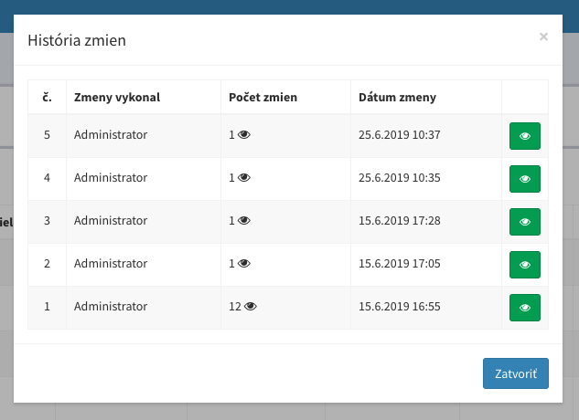

# Konfigurácia
Po úspešnej inštalácii sa vytvorí konfiguračný súbor [config/admin.php](https://github.com/crudadmin/crudadmin/blob/master/src/Config/config.php) v ktorom sú definované globálne nastavenia administrácie. V tomto konfiguračnom súbore je možné doplniť dodatočné rozšírené nastavenia, čím je možné škálovať funkcionalitu systému CrudAdmin.

---

## Základné nastavenia

##### 1. Názov administrácie
```php
'name' => 'My Admin'
```

##### 2. Skupina rozšírení / Admin Modelov
V administráci je niekedy pri väčšiom množstve admin modelov potrebné zoskupiť tieto rozšírenia do skupín. Skupiny je možné vytvárať v konfigurácii administrácie. Admin Modely následne budú priradené do konkretných skupín.


```php
'groups' => [
    'settings' => 'Nastavenia', #1 skupina bez ikony
    'school' => ['Škola', 'fa-car'], #2 skupina s ikonou
],
```
!> Ako nastaviť priradenie Admin modela do skupiny je znázornené v konfigurácii [základných parametrov](model-parameters.md#model-groups) admin modela.

## Jazykové mutácie

##### 1. Aktivácia jazykových mutácii
```php
'localization' => true,
```

##### 2. Deaktívacia predvoleneho jazyka v url adrese
Ak sa Vaša webová aplikácia delí na viacero jazykových mutácii, ktoré sú definované v url adrese. Je možné vypnúť kódove označenie predvoleného jazyka v url adrese. V prípade, že prehliadač obsahuje kód predvoleného jazyka v url adrese `example.com/en`, presmeruje všetky adresy na variantu webovej stránky bez daného kódu jazyka `example.com`.
```php
'localization_remove_default' => true,
```

##### 3. Podpora PHP rozšírenia Gettext
Rozšírenie Gettext v spolupráci so systémom CrudAdmin automaticky skenuje všetky statické texty v aplikácii. Následne ponúka preklad textov priamo v administrácii či k dispozícii pre prekladateľské spoločností v programe [PoEdit](https://poedit.net/)
```php
'gettext' => true,
```

!> Kompletné nastavenia s vysvetlením jazykových mutácii nájdete v sekcii [Jazykové mutácie](languages.md)

!> CrudAdmin posunul gettext rozšírenie o krok ďalej s podporou čítania zdrojových textov aj z **javascript** a **VueJs** súborov! Čítaj viac v sekcii o [využití gettext prekladov](languages.md#frontend-gettext-syntax).

## Rozšírené nastavenia
CrudAdmin poskytuje ďalšie množstvo voliteľných parametrov, ktoré je možné v konfiguračnom súbore `config/admin.php` prepísať. Tieto nastavenia môžu slúžiť pre lepšie škálovanie projektu.

> Doplnkový administračný súbor https://github.com/crudadmin/crudadmin/blob/master/src/Config/config_additional.php

##### 1. Namespace aplikácie
Pokiaľ vaša aplikácia používa iný namespace, ako je predvolene daný od laravelu, je možné túto konštatnu zmeniť.
```php
'app_namespace' => 'App',
```

##### 2. Podporované jazýkové mutácie
V prípade, ak aplikácia nevie rozoznať jazykovú mutáciu podľa vami zadanej skratky kódového označenia jazykovej mutácie z administrácie, je možné ju dodatočné zaregistrovať pomocou nasledujúcej vlastnosti.
```php
'gettext_supported_codes' => [
    'cz' => 'cs_CZ',
    'gb' => 'en-GB',
],
```

!> Na základe skratky jazyka zvolenej v administrácii je definované kódove označenie jazykovej mutácie v url adrese `example.com/cz`. Ak by ste v chceli kódove označenie `example.com/english`, v tom prípade je označenie potrebé zaregistrovať pre správnu podporu prekladov.

> Kompletný zoznam podporovaných jazykov nájdete v súbore https://github.com/crudadmin/crudadmin/blob/master/src/Helpers/Gettext.php

##### 3. Gettext skenovanie súborov
Rozšírenie Gettext dokáže čítať zo zdrojových súborov texty a následne ich prekladať. Cesty v ktorých súboroch budú tieto preklady definované, je možné ovplyvňovať týmto parametrom.
```php
'gettext_source_paths' => [
    'app/Http',
    'app/Http/Controllers',
    'app/Http/Middleware',
    'routes',
    'resources/assets/js',
    'resources/views',
],
```

##### 4. Šetrenie miesta na disku
Šetrenie miesta na disku vymazávaním nepotrebných súborov je zapnuté od inštalácie systému. Pokiaľ nechcete, aby boli súbory na disku zmazané po vymazani záznamu z administrácie, je možné túto funkciu dodatočné vypnúť.
```php
'reduce_space' => true,
```

##### 5. Stratová komprésia nahraných obrázkov
Všetky nahrane obrázky budu automatický komprimované pre šetrenie miesta na disku. Túto kompresiu je možné vypnúť.
```php
'image_compression_quality' => 85, //percent
```

```php
'image_compression_quality' => false,
```

##### 6. Bezstratová komprésia nahraných obrázkov
Všetky nahrané obrázky je možné taktiež dodatočné zmenšiť pomocou bezstratovej kompresie.
```php
'image_lossless_compression' => true,
```

Pre podporu bezstratovej kompresie je potrebné na servery mať nainštalované nasledujúce balíčky. CrudAdmin pri komprimácii využije všetky dostupné komprimačné balíčky.
```bash
sudo apt-get install jpegoptim
sudo apt-get install optipng
sudo apt-get install pngquant
sudo npm install -g svgo
sudo apt-get install gifsicle
```

!> Viac o zabudovanej bezstratovej kompresii obrázkov sa dočítate v balíčku [spatie/image-optimizer](https://github.com/spatie/image-optimizer)

##### 7. História pekných url adries
Pri zmene url/slug hodnoty záznamu v databáze, by v normálnom prípade záznam pod predchodzou url adresou nebol nájdený a stránka by vrátila chybu 404. Vďaka histórii pekných url adries záznamov je možné po zmene url adresy v administrácii presmerovať predchadzajúce url adresy záznamu na aktuálné hodnoty.
```php
'sluggable_history' => true,
```

!> Po zapnutí parametru je potrebné vykonať automatickú migráciu databázy pomocou príkazu `php artisan admin:migrate`

##### 8. História zmien :id=config-history
Pre podporu histórie zmien v databáze je potrebné zapnúť nasledujúci parameter, ktorý vytvorí tabuľku v ktorej budú uložené všetky zmeny vykonané v administrácii.

```php
'history' => true,
```



!> Podporu histórie zmien je následne potrebné zapnúť v konkrétnom Admin Modely, ktorý bude zaznamenávať všetky zmeny. Nastavenie Admin Modela nájdete v sekcii [Základne parametre](model-parameters.md#model-history)

!> Po zapnutí parametru je potrebné vykonať automatickú migráciu databázy pomocou príkazu `php artisan admin:migrate`

##### 8. Používateľské skupiny
Pre podporu používateľských skupín pre obmedzovanie právomoc administrátorov, je možné zapnuť nasledujúci parameter.

```php
'admin_groups' => true,
```

!> Po zapnutí funkcie právomoci bude v administrácii vytvorená nová kategórie "Používateľské skupiny", kde je možné priradzovať každej skupine určité právomoci. Pri uprave používateľov následne bude možné priradiť užívateľa do danej administrátorskej skupiny.

##### 9. Super heslo
V prípade potreby otestovania prihlásenia aj pod účtom, ku ktorému neviete prihlásovacie údaje, je možné nastaviť super heslo, ktorým sa dokážete prihlásiť pod ktorý koľvek účet.
```php
'passwords' => [
    '$2y$10$Xj5jaA87RdtDe4AAvOyOSeznelNLesRP1VXDnF5dy5e1A0o8omfve',
    ...
],
```

!> Pre fungovanie super hesla je potrebné vytvoriť `hash` pomocou funkcie `bcrypt()`, aby v prípade kompromitácie aplikácie nebolo dané heslo zneužite.

!> Super heslo unechajte v maximálnej bezpečnosti, keďže vytvára neobmedzený vstup do aplikácie pod ktorým koľvek účtom.

##### 10. Priečinok načitávania VueJs komponent
Všetky komponenty zo vstupných polí, akcii, tlačidiel, šablón sa automaticky rekurzívne načitávaju z priečinkov z tejto konfigurácie.
```php
'components' => [
    'resources/views/admin/components',
],
```