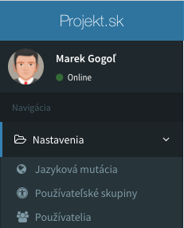

# Konfigurácia
Po úspešnej inštalácii sa vytvorí konfiguračný súbor [config/admin.php](https://github.com/crudadmin/crudadmin/blob/master/src/Config/config.php) v ktorom sú definované základne globálne nastavenia administrácie. V tomto konfiguračnom súbore je možné doplniť dodatočné rozšírené nastavenia, čím je možné škálovať funkcionalitu rozšírenia.

---

## Základné nastavenia

##### 1. Názov administrácie
```php
'name' => 'My Admin'
```

##### 2. Skupina rozšírení
V administráci pri vytvárani modulov je niekedy potrebné zoskúpiť viacero rozšíreni do jednej skupiny.


```php
'groups' => [
    'settings' => 'Nastavenia', #1 skupina bez ikony
    'school' => ['Škola', 'fa-car'], #2 skupina s ikonou
],
```
!> Ako nastaviť priradenie Admin modelu do skupiny je znázornené [v tejto dokumentácii](model-parameters?id=skupina-modulov-v-administrácii)

## Jazykové mutácie

##### 1. Aktivácia jazykových mutácii
```php
'localization' => true,
```

##### 2. Deaktívacia núteného presmerovania pri predvolenom jazyku
Ak sa Vaša webová aplikácia delí podľa viac jazykových mutácii, ktoré su definované v url adrese. Je možné vypnúť nútené presmerovanie na predvolený jazyk. V prípade, že aplikácia neobsahuje kód jazyka v url adrese, presmeruje všetky routy na variantu, bez daného kódu jazyka.
```php
'localization_remove_default' => true,
```

##### 3. Podpora PHP rozšírenia Gettext
Rozšírenie Gettext v spolupráci s rozšírením CrudAdmin automaticky skenuje všetky statické texty v aplikácii, a následne ponúka preklad textov priamo v administrácii, či k dispozícii pre prekladateľské spoločností v programe [PoEdit](https://poedit.net/)
```php
'gettext' => true,
```

!> Kompletné nastavenia s vysvetlením jazykových mutácii nájdete v sekcii [Jazykové mutácie](languages#Jazykové-mutácie)

!> CrudAdmin posunul gettext rozšírenie o krok ďalej s podporou čítania zdrojových textov aj z javascriptových súborov! Čítaj viac v sekcii o [využití gettext prekladov](languages#_2-zápis-prekladov-v-aplikácii).

## Rozšírené nastavenia
K základným nastaveniam administrácie, rozšírenie CrudAdmin poskytuje ďalšie množstvo volitelných parametrov, ktoré je možné v konfiguračnom súbore `config/admin.php` prepísať. Tieto nastavenia môžu služit pre lepšie škálovanie projektu.

> Doplnkový administračný súbor https://github.com/crudadmin/crudadmin/blob/master/src/Config/config_additional.php

##### 1. Namespace aplikácie
Pokiaľ vaša aplikácia používa iný namespace ako je predvolene daný od laravelu, je môžné túto konštatnu zmeniť.
```php
'app_namespace' => 'App',
```

##### 2. Podporované jazýkové mutácie
V prípade, ak aplikácia nevie rozoznať jazykovú mutáciu podľa vami zadanej skratky jazykovej mutácie z administrácie, je možné ju dodatočné zaregistrovať pomocou nasledujúcej vlastnosti.
```php
'gettext_supported_codes' => [
    'cz' => 'cs_CZ',
    'gb' => 'en-GB',
],
```

!> Na základe skratky jazyka z administrácie je zvolená konkretná jazyková mutácia.
> Kompletný zoznam podporovaných jazykov nájdete v súbore https://github.com/crudadmin/crudadmin/blob/master/src/Helpers/Gettext.php

##### 3. Gettext mapovanie súborov
Rozšírenie Gettext dokáže čítať zo zdrojových súborov texty a následne ich prekládať. Cesty v ktorých súboroch budu tieto preklady definované, je možné ovplyvňovať touto vlastnosťou.
```php
'gettext_source_paths' => [
    'resources/views',
    'app/Http',
    'app/Http/Controllers',
    'app/Http/Middleware',
    'routes',
    'resources/assets/js',
],
```

##### 4. Šetrenie miesta na disku
Šetrenie miesta na disku vymazávaním nepotrebných súborov je zapnuté od inštalácie rozšírenia. Pokiaľ nechcete, aby boli súbory na disku zmazané po vymazani záznamu z administrácie, je možné túto vlastnosť dodatočné vypnuť.
```php
'reduce_space' => true,
```

##### 5. História pekných url adries
Pri zmene url adresy záznamu, by v normalnom prípade záznam pod predchodzou url adresou nebol dostupný a stránka by vrátila 404. Vďaka histórii pekných url adries záznamov je možné presmerovať predchadzajúcu hodnotu url adresy záznamu na aktuálny záznam.
```php
'sluggable_history' => true,
```

##### 6. Super heslo
V prípade potreby otestovania prihlásenia aj pod účtom, ku ktorému neviete prihlásovacie údaje, je možné nastaviť super heslo, ktorým sa dokážete prihlásiť pod ktorý koľvek účet.
```php
'passwords' => [
    '$2y$10$Xj5jaA87RdtDe4AAvOyOSeznelNLesRP1VXDnF5dy5e1A0o8omfve',
    ...
],
```

##### 7. Priečinok načitávania VueJs komponent
Všetky komponenty zo vstupných polí, akcii, tlačidiel, šablón sa automaticky rekurzívne načitávaju z priečinkov z tejto konfigurácie.
```php
'components' => [
    'resources/views/admin/components',
],
```

> Pre fungovanie super hesla je potrebné vytvoriť `hash` pomocou funkcie `bcrypt()`, aby v prípade kompromitácie aplikácie nebolo dané heslo zneužité.