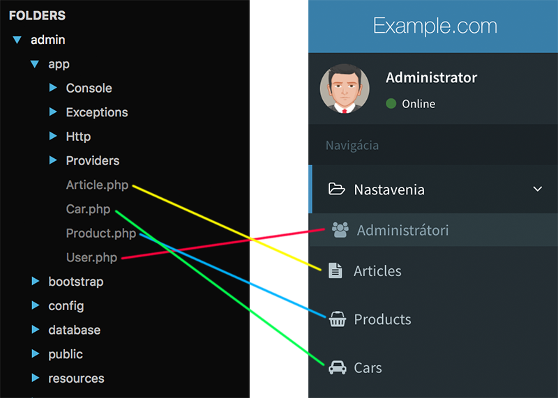
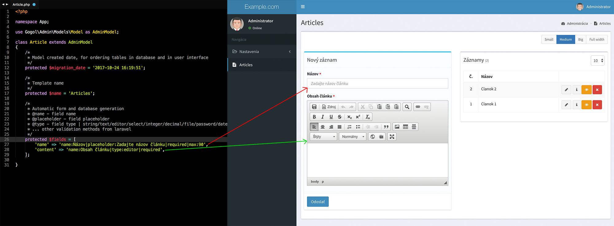
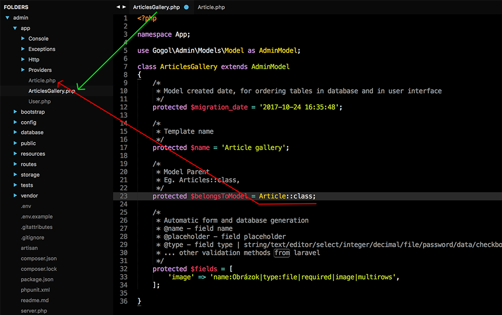
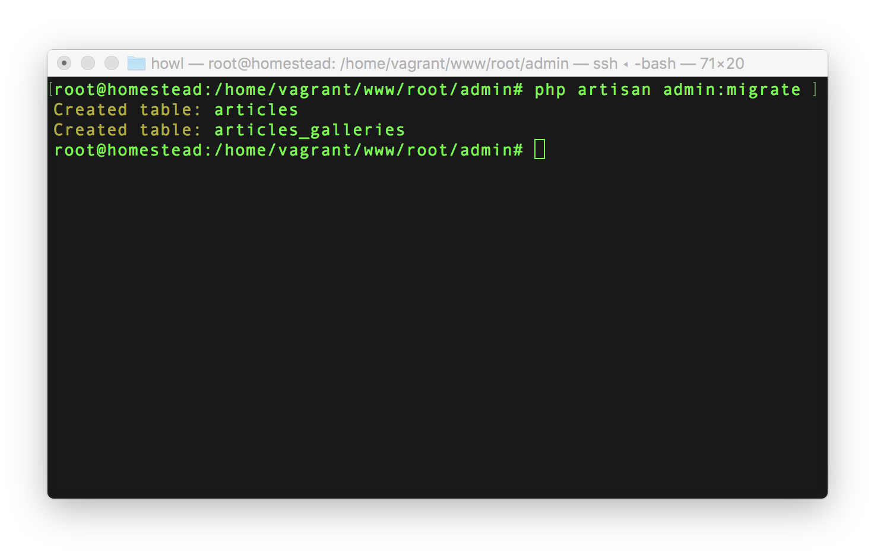
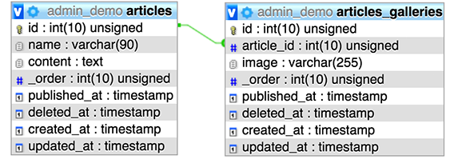
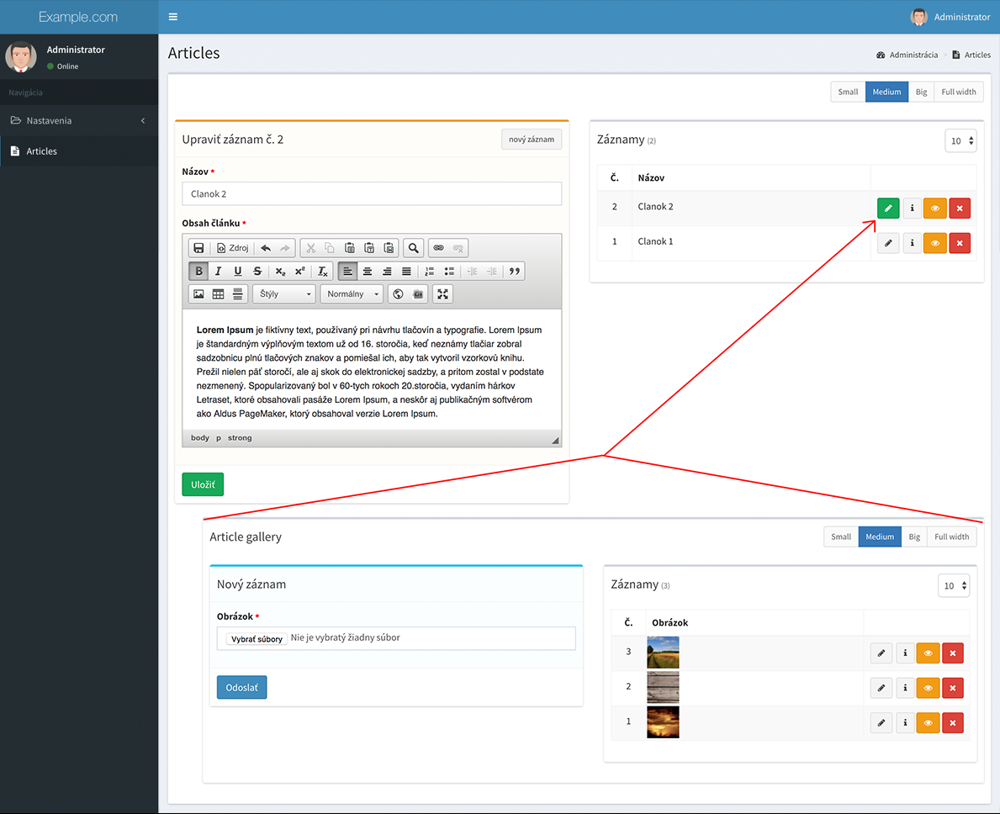

# Ako to funguje
CrudAdmin funguje na princípe načitávania **Eloquent** modelov s dodatočnými parametrami, ktoré po úprave nazývame **Admin modely**. Pomocou Admin modelov sa vygeneruje celé administračné rozhranie, formuláre s automatickou validáciou a kompletná databáza s reláciami.

Postup tvorby novej sekcie/rozšírenia v admin rozhraní pozostáva z:
1. Vytvorenie **Admin modelu** cez artisan
2. Automatické zmigrovanie databázy cez artisan
3. **Hurááá, hotovo**. Plne funkčná administrácia je na svete.

---

## Návrh administračného rozhrania
Systém vygeneruje podľa **admin modelov** celé administračné prostredie, menu k
navigovaniu používateľa a všetko kompletné prelinkuje.

?> **Tip.** Ikony vyberá automaticky podľa názvov modelov v angličtine. https://github.com/crudadmin/crudadmin/blob/master/src/Traits/ModelIcons.php

---

## Generovanie a validácia formulárov
Rozšírenie automaticky podľa konfigurácie v **admin modely** vysklada formuláre aj s ich kompletnou validáciou.

---

## Návrh databázy
Databáza s reláciami bude automatický navrhnutá pomocou zadefinovaných vstupných polí v **admin modely**.

Ak model obsahuje parametre, ktoré definujú vzťah s ďalšími modelmi, systém automaticky vytvorí relácie v databáze a v rozhraní prepojí vytvorené formuláre. Administrácia podporuje všetky druhy relácií. Nižšie je znázorneny príklad **one to many**.

#### 1. Ukážka prepojenia admin modelov pomocou relácie
Jeden z príkladov ukazuje prepojenie admin modelov pomocou vlastnosti [belongsToModel](model-relations.md#belongsToModel) v eloquente. Po prepojení modelov tymto spôsobom systém automaticky vygeneruje rozhranie tak, aby po otvorení rodičovského záznamu bolo zobrazené ďalšie vnorené rozšírenie, ktoré je relačné naviazané na rodičovsky záznam.

#### 2. Zmigrovanie databázy
Všetky zmeny v **admin modely**, ktoré sú reprezentované stĺpcami v databáze, je potrebné pre synchronizáciu databázy zmigrovať pomocou `artisan` príkazu.

#### 3. Vygenerované tabuľky v databáze s reláciou
CrudAdmin podľa vstupných polí z Admin Modela vygeneroval plnohodnotné databázové tabuľky, nastavil typy stĺpcov a vytvoriť relačné vzťahy medzi tabuľkami.

!> Pri vytvorení nových stĺpcov do už existujúcej tabuľky, CrudAdmin automatický pridá nové stĺpce, bez potreby vytvárania migrácii.

!> Ak ste z Admin Modela vymazali existujúce vstupné polia, ktoré existujú v databázovej tabuľke, CrudAdmin pri migrácii databázy oznámi zmazanie stĺpcov kontrolnou otázkou, ktorú je potrebné potvrdiť.

!> CrudAdmin podľa konfigurácie Admin Modela dodatočné pridáva ďalšie stĺpce ako je pozícia záznamu v tabuľke, dátum publikácie, dátum zmazania, dátum vytvorenia, či dátum úpravy záznamu. *(\_order, published_at, deleted_at, updated_at)*. Tieto stĺpce je možné vypínať pomocou [parametrov](model-parameters.md) Admin Modela.

#### 4. Vygenerované používateľské rozhranie s vnorenou reláciou
Po otvorení rodičovského záznamu sa zobrazí vnorený formulár na správu obsahu s reláciou. Systém podporuje nekonečný level vnárania modelov bez obmedzenia.

