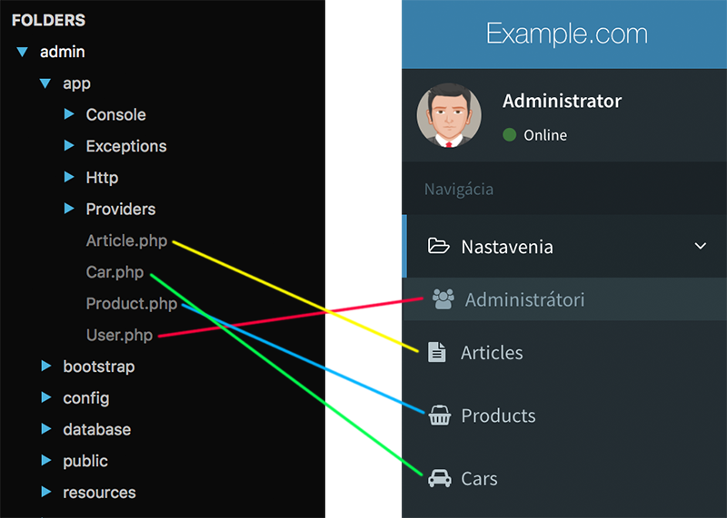
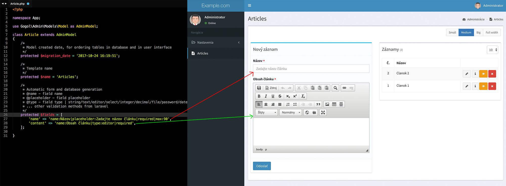
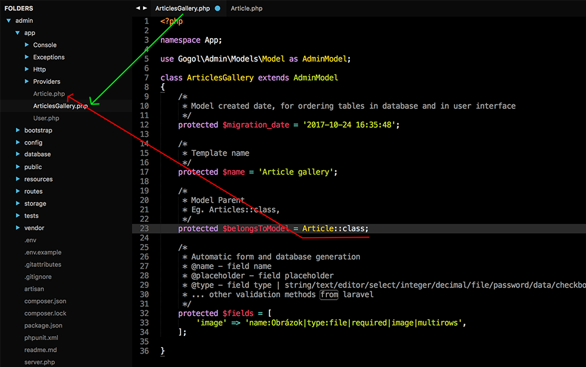
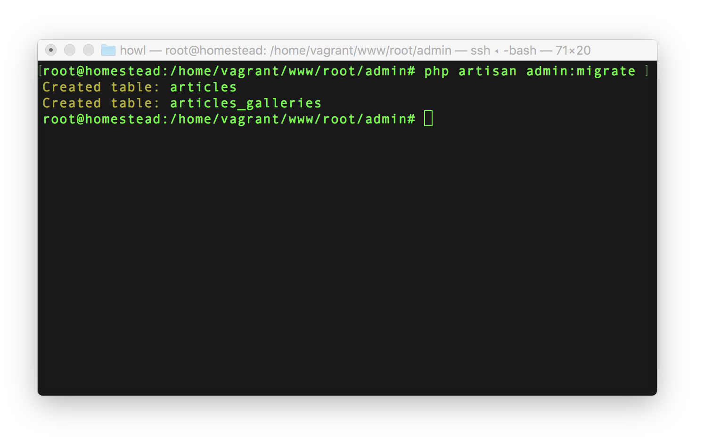
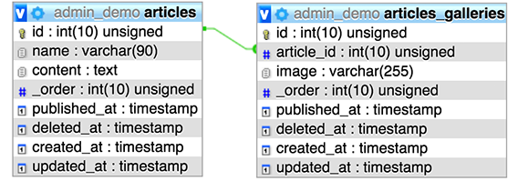
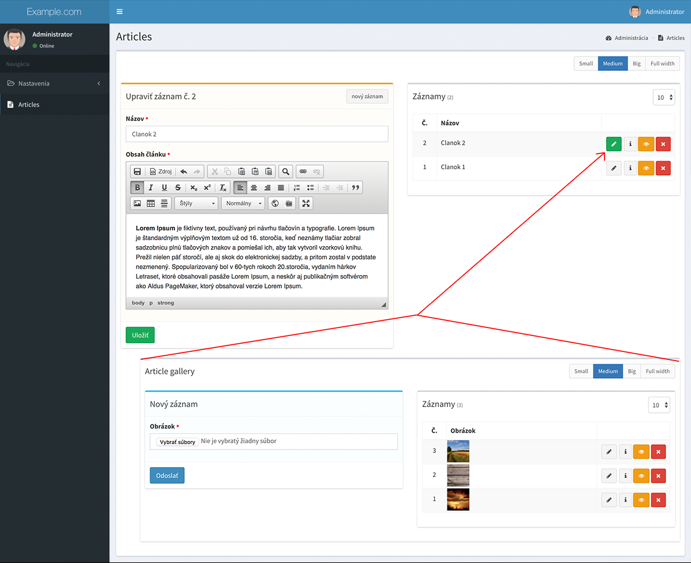

# Ako to funguje
CrudAdmin funguje na princípe mapovania **Eloquent** modelov s
dodatočnými parametrami, ktoré po úprave nazývame **Admin modeli**.
Pomocou Admin modelov sa vygeneruje celé administračné rozhranie,
formuláre s automatickou validáciou a kompletnou databázou s reláciami.

1. Vytvorenie **Admin modelu** cez artisan
2. Automatické zmigrovanie databázy cez artisan
3. **Hurááá, hotovo**. Administrácia je na svete.

---

## Návrh administračného rozhrania
Systém vygeneruje podľa **admin modelov** celé administračné prostredie, menu k
navigovaniu používateľa a všetko kompletné prelinkuje.

?> **Tip.** Ikony vyberá automaticky podľa názvov modelov.

---

## Generovanie a validácia formulárov
Rozšírenie automaticky podľa konfigurácie v **admin modeli** vysklada formuláre aj s ich kompletnou validáciou.

---

## Návrh databázy
Databáza s reláciami bude navrhnutá pomocou vytvoreného **admin
modelu**. Ak model obsahuje parametre, ktoré definujú vzťah s ďalšími modelmi,
systém automaticky vytvorí relácie v databáze a v rozhraní prepojí vytvorené formuláre.
Administrácia podporuje všetky druhy relácií. Nižšie je znázorneny príklad **one to many**.

#### 1. Ukážka prepojenia admin modelov
Jeden z príkladov ukazuje prepojenie admin modelov pomocou vlastnosti v eloquente. Pri
prepojení modelov tymto spôsobom systém automaticky vygeneruje rozhranie tak, aby po otvorení
rodičovského záznamu bolo zobrazené ďalšie vnorené rozšírenie.

#### 2. Zmigrovanie databázy
Všetky zmeny v **admin modeli**, ktoré sú reprezentované v stĺpcoch v databáze, je potrebne zmigrovať
pomocou `artisan` príkazu.

#### 3. Vygenerovaná relácia v databáze

#### 4. Vygenerované používateľské rozhranie s vnorenou reláciou
Po otvorení rodičovského záznamu sa zobrazí vnorený formulár na správu obsahu s reláciou.
Systém podporuje nekonečný level vnárania modelov bez obmedzenia.

