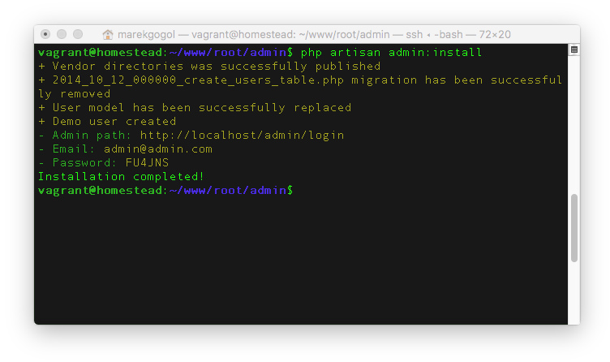
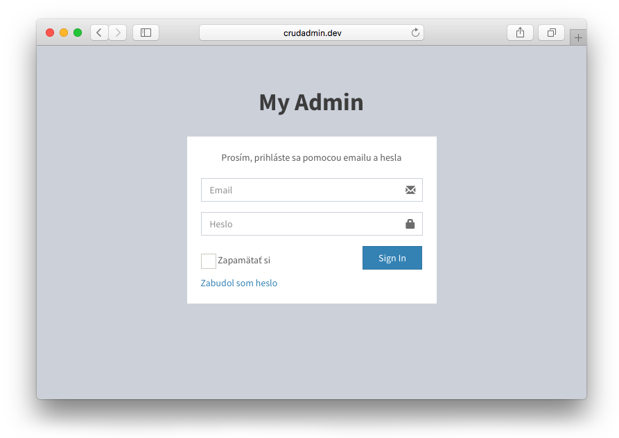

# Inštalácia

## Minimálne požiadavky
1. Laravel 5.4
2. PHP 7.1
3. MySql 5.7
4. Apache / Nginx

---

## 1. Inštalácia Laravel 5.4+
Ako prvý krok je potrebné nainštalovať [Laravel framework](https://laravel.com/docs/master/installation). Po jeho kompletnej inštalácii, nastavenej databázy môžme prejsť k ďalšiemu kroku.

---

## 2. Pridanie rozšírenia CrudAdmin
Po úspešnej inštalácii Laravelu potrebujeme pridať nové rozšírenie. Balíček môžte taktiež nájsť na adrese https://packagist.org/packages/crudadmin/crudadmin.

### Cez composer

```bash
composer require "crudadmin/crudadmin"
```

### Registrácia rozšírenia do verzie Laravel 5.4 a nižšiej
Service provider pridáme do `config/app.php`, ktorým povieme Laravelu aby načítal náš balíček.
```php
Admin\Providers\AppServiceProvider::class
```

!> Pri verzii **Laravel 5.5** a novšiej sa rozšírenie zaregistruje automaticky, čiže tento krok môžte preskočiť.

## 3. Inštalácia rozšírenia

```bash
php artisan admin:install
```



Po spustení prikazu inštalácie sa vykonaju tieto zmeny

1. Nakopírujú sa `assets` súbory so všetkými public súbormi do priečinku `/public/vendor/crudadmin`
2. Vytvorí sa konfiguráčny súbor administrácie `/config/admin.php`
3. Vytvorí sa základná databázova vrstva s tabuľkou používateľov a jedným demo účtom. Prihlásovacie údaje uvidíte v termináli.
4. vymaže sa nepotrebná migrácia pre vytvorenie tabuľky používateľov `/database/migrations/2014_10_12_100000_create_password_resets_table.php` *(CrudAdmin migrácie nepotrebuje)*

## 4. Huráá, hotovo!
Gratulujem. Rozšírenie bolo úspešne nainštalované a momentálne je všetko priprávene k tvorbe vášho projektu.



!> Administrácia je dostupná na adrese http://yourdomain.com/admin

!> Prihlásovacie údaje boli vygenerované pri inštalácii v termináli, po prihláseni ich môžete zmeniť.