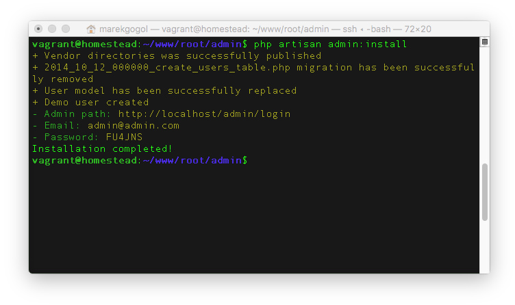

# Inštalácia

## Minimálne požiadavky
1. Laravel 5.3
2. PHP 5.6
3. MySql 5.7
4. Apache / Nginx

---

## 1. Inštalácia Laravel 5
Ako prvý krok je potrebné nainštalovať Laravel framework, ktorý nájdete
na adrese https://laravel.com/docs/master . Po jeho kompletnej inštalácii,
nastavení databázy môžme prejsť k ďalšiemu kroku.

```bash
composer create-project laravel/laravel
```

```bash
php artisan key:generate
```

---

## 2. Pridani rozšírenia CrudAdmin
Po úspešnej inštalácii Laravelu potrebujeme pridať nové rozšírenie. Balíček môžte taktiež nájsť taktiež na adrese https://packagist.org/packages/marekgogol/crudadmin.

### Cez composer

```bash
composer require "marekgogol/crudadmin"
```

### Registrácia rozšírenia do Laravelu
Pri verzii **Laravelu 5.5** a novšiej sa rozšírenie zaregistruje automaticky. V prípade nižšiej verzie postupujte nasledovne.

Pridáme do `config/app.php` service provider, ktorým povieme Laravelu aby načítal náš balíček.
```php
Gogol\Admin\Providers\AppServiceProvider::class
```

## 3. Inštalácia rozšírenia

```bash
php artisan admin:install
```



Po spustení prikazu inštalácie sa vykonaju tieto zmeny

1. Nakopíruje sa `/assets` so všetkými public súbori do priečinku `/public/assets/admin`
2. Vytvori sa konfiguráčny súbor administrácie `/config/admin.php`
3. Vytvorí sa základná databázova vrstva s tabuľkou používateľov a jedným demo účtom. Prihlásovacie údaje uvidíte v termináli.
4. vymaže sa nepotrebná migrácia pre vytvorenie tabuľky používateľov `/database/migrations/2014_10_12_100000_create_password_resets_table.php`

## 4. Huráá, hotovo!
Gratulujem. Rozšírenie bolo úspešne nainštalované a momentálne je všetko priprávene k tvorbe vášho projektu.


!> Administrácia je dostupná na adrese http://yourdomain.com/admin

!> Prihlásovacie údaje boli vygenerované pri inštalácii v termináli, po prihláseni ich môžete zmeniť.