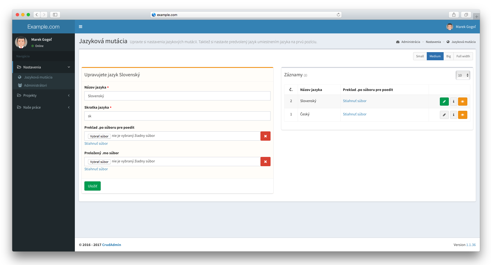
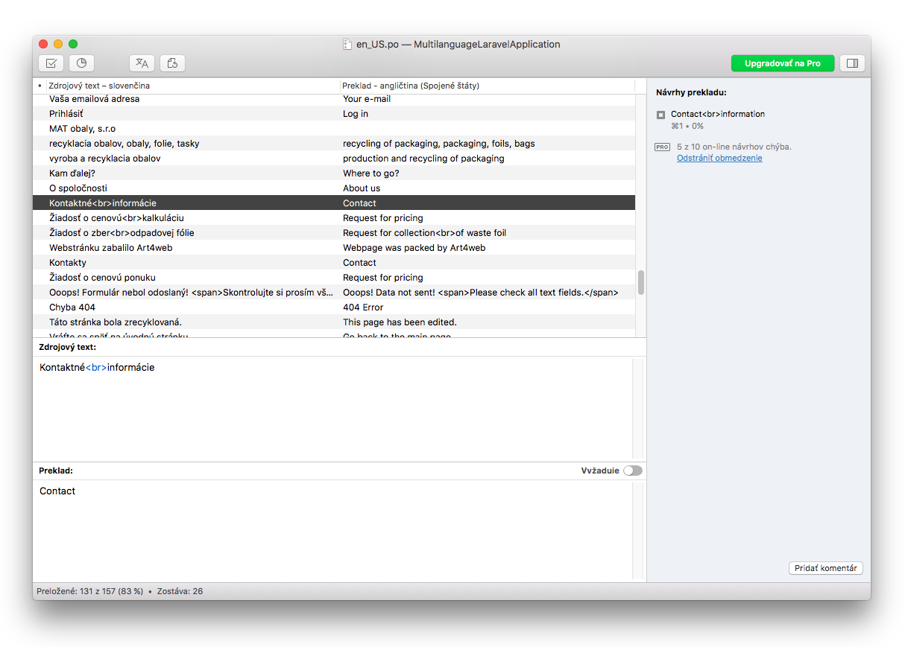
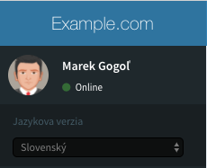
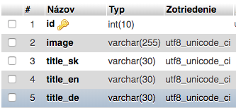
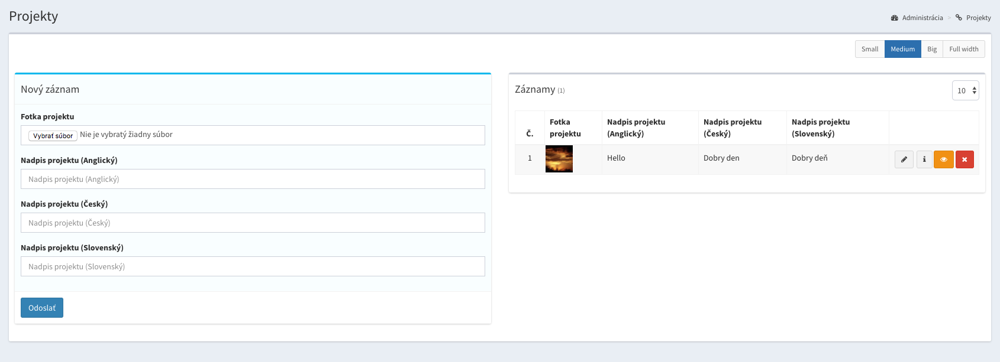

# Jazykové mutácie
V tejto dokumentácii nájdete všetky konfigurácie jazykových mutácii v súbore `config/admin.php`

- [Aktivácia a nastavenie](#Aktivácia-a-nastavenie)
- [Správa a preklad dynamického obsahu](#Správa-a-preklad-dynamického-obsahu)
  - [Unikatný obsah pre každú jazykovú verziu](#_1-Unikatný-obsah-pre-každú-jazykovú-verziu)
  - [Zrkadlenie obsahu](#_2-Zrkadlenie-obsahu)

---


## Aktivácia a nastavenie

##### 1. Aktivácia jazykových mutácii
Ak aplikácia vyžaduje viac jazyčné rozšírenia, prepnite v konfigurácii tento parameter na hodnotu `true`.
Následne bude potrebné spustit migráciu databázy, ktorá automaticky vytvorí tabuľku `languages` s
jazykmi a taktiež pridá daný modul do administrácie pre správu jazykov.

```php
'localization' => true,
```

Pre aktiváciu automatického presmerovania na predvolenú jazykovú verziu je potrebné pridať globálnu **middleware** do súboru **app\Http\Kernel.php**.
```php
    /**
     * The application's global HTTP middleware stack.
     *
     * These middleware are run during every request to your application.
     *
     * @var array
     */
    protected $middleware = [
        ...

        \Gogol\Admin\Middleware\LocalizationMiddleware::class,
    ];
```

!> Po príchode na stránku systém automaticky presmeruje klienta na predvolenú jazykovú mutáciu.
   `http://example.com/` presmeruje na `http://example.com/sk`.

!> Pri aktívnej jazykovej mutácii system automatický **presmeruje všetky routy** na adresu s kódom jazyka.
   `http://example.com/clanky` presmeruje na `http://example.com/sk/clanky`.

!> Prvý pridaný jazyk v administrácii je ako predvolený.

!> Nezabudnite na `php artisan admin:migrate` pre migráciu databázy.

##### 2. Deaktívacia núteného presmerovania pri predvolenom jazyku
Klient bude po príchode na stránku automatický presmerovaný na kódove označenie predvolenej jazykovej mutácie.<br>
`http://example.com/` sa presmeruje na `http://example.com/sk`<br>

Nútene presmerovanie môžeme zakázať nasledujúcim parametrom. Ak sa klient bude nachádzať na predvolenej jazykovej mutácii, systém sprístupní všetky url adresy aj bez kódoveho označenia v url adrese.

```php
'localization_remove_default' => true,
```

?> Pri predvolenom jazyku bude obsah na adrese `http://example.com/sk/clanky` dostupný len bez kódoveho označenia predvoleného jazyka na adrese `http://example.com/clanky`.

##### 3. Podpora PHP rozšírenia Gettext
Systém taktiež podporuje technológiu prekládania webov zvanú **Gettext**.
Po jeho spustení bude potrebné spustit migráciu databázy ktorá sa postará
o pridanie stĺpcov do jazykovej tabuľky a taktiež prida možnost úpravy **PO** a **MO** súborov.

```php
'gettext' => true,
```

Po uložení nastavení jazykov v administrácii systém zozbiera všetky preložené texty z
**views**, **controllers**, **middlewares** a ďalších súborov, ktoré uloži do cache z ktorých **PoEdit** načíta všetky dostupné preklady.

!> Gettext je zapisovaný v tvare `_('toto je preklad')`.

!> Umiestnenie vytvorených a nahraných **.PO** a **.MO** súborov, nájdete na adrese `/storage/app/lang/gettext/en_EN/LS_MESSAGES/`

##### Vygenerované rozhranie pre upload súborov z programu PoEdit:


##### Preklady zozbieraných textov z webu v programe PoEdit


?> PoEdit pre preklad textov stiahnete na adrese https://poedit.net/

---

## Správa a preklad dynamického obsahu
Po úspešnom nastavení jazykových mutácii a nastavení prekladov statických textov je možné automaticky vygenerovať rozhranie
aj k prekladaniu dynamických textov.

---

#### 1. Unikatný obsah pre každú jazykovú verziu
- V prípade unikatného obsahu pre každú jazykovú verziu sa automatický vytvorí relácia medzi modelom a tabuľkou `languages`.
- Každá jazyková mutácia obsahuje na webe vlastné záznamy.
- Zmenu jazykov je možné vykonať pod profilovou fotkou administrátora.
  Po zmenení jazykovej mutácie sa v tabuľke záznamov zobrazia záznamy k zvolenému jazyku.

!> Zmena jazykov je možná iba v rozšírení, ktoré podporuje viacjazyčné mutácie



Unikátny obsah povolime v modeli pomocou vlastnosti `$localization = true`

```php
<?php

namespace App;

use Gogol\Admin\Models\Model as AdminModel;

class Article extends AdminModel
{
    ...

    /*
     * Enable multilanguages
     */
    protected $localization = true;


    /*
     * Automatic form and database generation
     * @name - field name
     * @placeholder - field placeholder
     * @type - field type | string/text/editor/select/integer/decimal/file/password/data/checkbox
     * ... other validation methods from laravel
     */
    protected $fields = [
        'name' => 'name:Názov|placeholder:Zadajte názov článku|required|max:90',
        'content' => 'name:Obsah|type:editor',
    ];

}
```

Pre výber záznamov z databázy pre aktuálnu jazykovú mutáciu na ktorej sa klient práve nachádza, je v modeli preddefinovaná lokálna scope s názvom `$model->localization()`.
```php
<?php

use ...

class ArticleController extends Controller
{
    public function index()
    {
        $articles = Article::localization()->get();

        return view('articles', compact('articles'));
    }
}

```

!> Po povolení viacjazyčných mutácii v modeli nezabudníte spustiť `php artisan admin:migrate` pre automatické pridanie relácie s tabuľkou `languages`

---

#### 2. Zrkadlenie obsahu
Pri zrkadlení obsahu sa záznam v databáze nachádza jediný krát, no každa jazyková mutácia reprezentuje jeden stĺpec v danej tabuľke pod príslušným vstupným parametrom.



Zrkadlenie obsahu povolime pomocou parametru `localization`, ktorý pridáme do zoznamu parametrov pre vstupnú hodnotu.

```php
    ...

    /*
     * Automatic form and database generation
     * @name - field name
     * @placeholder - field placeholder
     * @type - field type | string/text/editor/select/integer/decimal/file/password
     * ... other validation methods from laravel
     */
    protected $fields = [
        'image' => 'name:Fotka projektu|type:file|image',
        'title' => 'name:Nadpis projektu|type:string|localization',
    ];
```

##### Rozhranie


!> Pri prekladaní jednej vstupnej hodnoty sa vytvori toľko stĺpcov, koľko je jazykov v databáze. Po pridaní každého jazyka je nutné spustiť
`php artisan admin:migrate` pre synchronizáciu jazykových stĺpcov. V prípade zrkadlenia obsahu je opravnený pridavať nový jazyk len developer projektu
a nie samotný klient.