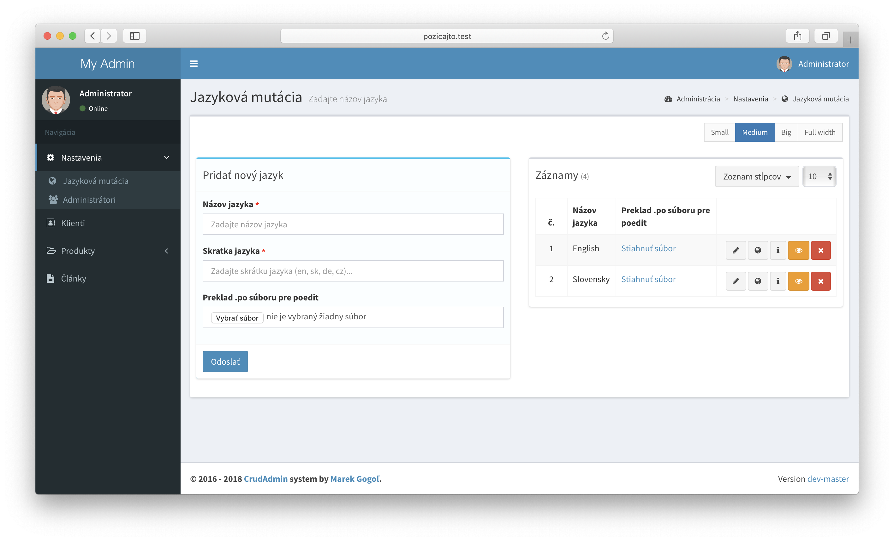

# Jazykové mutácie
V tejto dokumentácii nájdete všetky konfigurácie jazykových mutácii v súbore `config/admin.php` a ich správne využívanie.

- [Aktivácia a nastavenie](#Aktivácia-a-nastavenie)
- [Gettext - Preklady statických textov](#gettext-preklady-statických-textov)
  - [Aktivácia a nastavenia rozšírenia Gettext](#_1-aktivácia-a-nastavenia-rozšírenia-gettext)
  - [Zápis prekladov v aplikácii](#_2-zápis-prekladov-v-aplikácii)
    - [PHP súbory](#php-súbory)
    - [JS/VueJs súbory](#prekladanie-javascriptových-súborov)
  - [Správa prekladu statických textov](#_3-správa-prekladu-statických-textov)
- [Správa a preklad dynamického obsahu](#Správa-a-preklad-dynamického-obsahu)
  - [Unikatné záznamy pre každú jazykovú verziu](#_1-unikatné-záznamy-pre-každú-jazykovú-verziu)
  - [Zrkadlenie obsahu - preklad konkretných stĺpcov](#_2-zrkadlenie-obsahu-preklad-konkretných-stĺpcov)

---


## Aktivácia a nastavenie

##### 1. Aktivácia jazykových mutácii
Ak aplikácia vyžaduje viac jazyčné rozšírenia, prepnite v konfigurácii tento parameter na hodnotu `true`.
Následne bude potrebné spustit migráciu databázy, ktorá automaticky vytvorí tabuľku `languages` s
jazykmi a taktiež pridá daný modul do administrácie pre správu jazykov.

```php
'localization' => true,
```

!> Prvý pridaný jazyk v administrácii je ako predvolený.

!> Nezabudnite na `php artisan admin:migrate` pre migráciu databázy.

##### 2. Nútene presmerovanie pri predvolenej jazykovej mutácii
Pre aktiváciu automatického presmerovania na predvolenú jazykovú verziu je potrebné pridať globálnu **middleware** do súboru **app\Http\Kernel.php**.
```php
    /**
     * The application's global HTTP middleware stack.
     *
     * These middleware are run during every request to your application.
     *
     * @var array
     */
    protected $middleware = [
        ...

        \Gogol\Admin\Middleware\LocalizationMiddleware::class,
    ];
```

> Po príchode na stránku systém automaticky presmeruje klienta na predvolenú jazykovú mutáciu.
   `http://example.com/` presmeruje na `http://example.com/sk`.

<!-- -->

> Pri aktívnej jazykovej mutácii system automatický **presmeruje všetky routy** na adresu s kódom jazyka.
   `http://example.com/clanky` presmeruje na `http://example.com/sk/clanky`.

##### 3. Deaktívacia núteného presmerovania pri predvolenom jazyku
Klient bude po príchode na stránku automatický presmerovaný na kódove označenie predvolenej jazykovej mutácie.<br>
`http://example.com/` sa presmeruje na `http://example.com/sk`<br>

Nútene presmerovanie môžeme zakázať nasledujúcim parametrom. Ak sa klient bude nachádzať na predvolenej jazykovej mutácii, systém sprístupní všetky url adresy aj bez kódoveho označenia v url adrese.

```php
'localization_remove_default' => true,
```

!> Pri predvolenom jazyku bude obsah na adrese `http://example.com/sk/clanky` dostupný len bez kódoveho označenia predvoleného jazyka na adrese `http://example.com/clanky`.

---

## Gettext - Preklady statických textov
Pri správe jazykov systém CrudAdmin v spolupráci s rozšírením Gettext zozbiera všetky statické zdrojové texty z aplikácie a sprístupni ich k prekladu vo forme *.po* súborov [(PoEdit)](https://poedit.net/) určených pre prekladateľské spoločnosti, či vo forme online editora v administrácii, pomocou ktorého si klient dokáže spravovať a prekladať všetky statické texty na webe, či aplikácii.

#### 1. Aktivácia a nastavenia rozšírenia Gettext
V konfiguračnom súbore `config/admin.php` je potrebné zapnúť dané rozšírenie.
```php
'gettext' => true,
```


Pre aktiváciu prekladov v JavaScriptoch a VueJs komponentoch na strane frontendu, je nutné pridať knižnicu, ktorá sa postara o inicializovanie funkcii prekladov, pomocou ktorých bude následne možné dané texty prekládať. O to všetko sa postará **blade direktíva** `@gettext`, ktorú stači vložiť do hlavného layoutu, ako prvú v poradí spúštaných javascriptov. Systém následne injektne do stránky potrebné knižnice s prekladmi a postará sa o ich efektívne cachovanie.
```blade
        ...

        @gettext

        <script src="{{ mix('js/app.js') }}"></script>
    </body>
</html>
```

V prípade využitia VueJs, je potrebné do Vue vložiť modul, ktorý sa postará o lokálne nabindovanie prekladateľských funkcii v `this` konštruktore každej komponenty. V súbore **resources/js/app.js** je potrebné vložiť `Vue.use(Gettext)`.
```javascript
require('./bootstrap');

window.Vue = require('vue');

Vue.use(Gettext);
```

!> Systém automaticky skenuje dôležité priečinky, v ktorých by sa mohli nachádzať súbory s prekladmi. Pri každej zmene načíta všetky zdrojové texty, k ich budúcemu prekladu. Cesty priečinkov v ktorých CrudAdmin skenuje, sú vopred definované v [rozšírenej konfigurácii](config.md#_1-gettext-mapovanie-súborov), ktorú môžte ľubovoľne prepísať s vlastným zoznamom priečinkov, v ktorých ma systém texty na preklad vyhľadávať.

!> Pri aktivácii gettext rozšírenia je potrebné spustit migráciu databázy pomocou `php artisan admin:migrate`, ktorá sa postará o pridanie stĺpcov do jazykovej tabuľky a taktiež prida možnost úpravy **PO** a **MO** súborov.

!> **.PO** súbor určeny k prekladu je dostupný k stiahnutiu v administrácii.

#### 2. Zápis prekladov v aplikácii
Pre správne načítanie prekladov v aplikácii, je potrebné zapísať všetky statické texty v správnom tvare. V nasledujúcich príkladoch, sú znázornené kombinácie prekladov vo viacerých jazykoch, ako pre singulár, tak aj vo forme plurálu.

##### PHP súbory
V PHP súboroch platia zaužívane funkcie podľa platnej [PHP](http://php.net/manual/en/function.gettext.php) dokumentácie.
```php
#singular
echo _('This is my translate');

#plural
$count = 2;
echo sprintf(ngettext('%d car', '%d cars', $count), $count);
```

##### Blade súbory sú prekladané rovnakým spôsobom ako klasické PHP
```blade
<div>{{ _('This is my translate') }}</div>
<div>{{ sprintf(ngettext('%d car', '%d cars', $count), $count); }}</div>
```

##### Prekladanie Javascriptových súborov
Preklady dokáže rozšírenie CrudAdmin načítavať aj z javascriptových súborov. Pomocou vopred definovaných metód z [injeknutej knižnice](#_1-aktivácia-a-nastavenia-rozšírenia-gettext) do webu.

```javascript
var a = _('This is my translate');
var b = __('This is my translate');
var c = gettext('This is my translate');

var d = n__('%d car', '%d cars', 2).replace('%d', 2);
var e = ngettext('%d car', '%d cars', 2).replace('%d', 2);

console.log(a, b, c, d, e);
```

##### Prekládanie VueJs komponentov
Prekládanie VueJs komponentov nesie rovnaké javascriptové funkcie, ako v prípade čistého javascriptu. Len s tym rozdielom, že su taktiež nabindovane do každej Vue komponenty, čize sú prístupné ako globálne, tak aj v `this` konštruktore.

```VueJs
<template>
    <div>{{ _('This is my translate') }}</div>
    <div>{{ n__('%d car', '%d cars', 2).replace('%d', 2) }}</div>
    <div>{{ myTranslate() }}</div>
    ...
</template>

<script>
export default {
    ...
    methods: {
        myTranslate()
        {
            var trans1 = __('I have'),
                trans2 = n__('%d car', '%d cars', 2).replace('%d', 2),
                trans3 = this._('and'),
                trans4 = ngettext('%d wheel', '%d wheels', 4).replace('%d', 4);

            return trans1 + ' ' + trans2 + ' ' + trans3 + ' ' + trans4;
        }
    }
}
</script>
```

#### 3. Správa prekladu statických textov

###### Vygenerované rozhranie pre upload súborov z programu PoEdit:


##### Online editor v administrácii pre správu prekladov


##### Preklady zozbieraných textov z webu v programe PoEdit


?> PoEdit pre preklad textov stiahnete na adrese https://poedit.net/

---

## Správa a preklad dynamického obsahu
Po úspešnom nastavení jazykových mutácii a nastavení prekladov statických textov je možné automaticky vygenerovať rozhranie aj k prekladaniu dynamických textov uložených v databáze.

---

#### 1. Unikatné záznamy pre každú jazykovú verziu
- V prípade unikatného obsahu pre každú jazykovú verziu sa automatický vytvorí relácia medzi modelom a tabuľkou `languages`.
- Každá jazyková mutácia obsahuje na webe vlastné záznamy.
- Zmenu jazykov je možné vykonať pod profilovou fotkou administrátora, alebo vo formulári daného rozšírenia. Po zmenení jazykovej mutácie sa v tabuľke záznamov zobrazia záznamy k zvolenému jazyku.


!> Zmena jazykov je možná iba v rozšírení, ktoré podporuje viacjazyčné mutácie

Unikátny obsah povolime v modely pomocou vlastnosti `$localization = true`

```php
<?php

...

class Article extends AdminModel
{
    /*
     * Enable multilanguages
     */
    protected $localization = true;


    /*
     * Automatic form and database generation
     * @name - field name
     * @placeholder - field placeholder
     * @type - field type | string/text/editor/select/integer/decimal/file/password/data/checkbox
     * ... other validation methods from laravel
     */
    protected $fields = [
        'name' => 'name:Názov|placeholder:Zadajte názov článku|required|max:90',
        'content' => 'name:Obsah|type:editor',
    ];

}
```

Pre výber záznamov z databázy pre aktuálnu jazykovú mutáciu na ktorej sa klient práve nachádza, je v modely preddefinovaná lokálna scope s názvom `$model->localization()`.
```php
<?php

use ...

class ArticleController extends Controller
{
    public function index()
    {
        $articles = Article::localization()->get();

        return view('articles', compact('articles'));
    }
}

```

!> Po povolení viacjazyčných mutácii v modely nezabudníte spustiť `php artisan admin:migrate` pre automatické pridanie relácie s tabuľkou `languages`

---

#### 2. Zrkadlenie obsahu - preklad konkretných stĺpcov
Pri zrkadlení obsahu sa záznam v databáze nachádza jediný krát, no každá jazyková mutácia reprezentuje rozdielnu hodnotu v danom stĺpci.

Preklad konkretných stĺpcov povolime pomocou parametru `locale`, ktorý pridáme do zoznamu parametrov pre vstupnú hodnotu, ktorú chceme prekladať.

```php
    ...

    protected $fields = [
        'name' => 'name:Nadpis projektu|type:string|locale',
    ];
```

!> Pri prekladaní jednej vstupnej hodnoty sa typ stĺpca zmení na format **JSON** v ktoróm budu uložené hodnoty všetkych jazykových mutácii.

!> V prípade, že sa klient nachádza na inej ako predvolenej jazykovej mutácii, a záznam neobsahuje preloženu hodnotu, systém automaticky použije hodnotu predvoleného jazyka metódou "fallback".