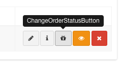
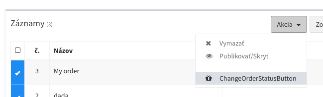

# Vlastné akcie / Tlačidla

V niektorých prípadoch je v rozšírení potrebné vykonavať akcie nad danym záznamom, či skupinou záznamov. Napríklad v objednávke potrebujete zmeniť stav objednavky, ktorý zároveň odošle notifikáciu kurierovi alebo vykoná ďalšie požiadavky.

K takým prípadom služia vlastné tlačidlá, ktoré sú zobrazené v tabuľke záznamov. Po kliku na dane tlačidlo, sa odošle požiadavka na server, s ktorou je možné následne pracovať, vykonávať ďalšie akcie, či vrátiť hlášku používateľovi.

- [Vytvorenie prvého tlačidla](#Vytvorenie-prvého-tlačidla)
- [Registrácia tlačidla](#Registrácia-tlačidla)
- [Vzhľad tlačidla](#Vzhľad-tlačidla)
- [Nastavenie generovania tlačidla](#Nastavenie-generovania-tlačidla)
- [Vykonanie akcie tlačidla](#Vykonanie-akcie-tlačidla)
- [Akcia s upozonením alebo otázkov](#Akcia-s-upozonením-alebo-otázkov)

<hr>

## Vytvorenie prvého tlačidla

Tlačidlo je možné vytvoriť pomocou `artisan` príkazu.

```
php artisan admin:button ChangeOrderStatusButton
```

Po spustení príkazu bude vytvorený konfiguračný súbor tlačidla v zložke `app/Admin/Buttons/ChangeOrderStatusButton.php`

<hr>

## Registrácia tlačidla

Tlačidlo po vytvorení priradime k Admin Modelu pomocou parametru `$buttons`.

```php
use App\Admin\Buttons\ChangeOrderStatusButton;

class Order extends AdminModel
{
    ...

    protected $buttons = [
        ChangeOrderStatusButton::class
    ];
}
```

<hr>

## Vzhľad tlačidla
Po registrácii tlačidla bude automatický zobrazené pri každom zázname v postranom paneli tabuľke záznamov.


Ak sa bude jednať o tlačidlo alebo akciu, ktoré je schopné aplikovať nad viacerými označenými záznamami, toto tlačidlo bude po označení záznamov umistnené v lište akcii.


<hr>

## Nastavenie generovania tlačidla

Tlačidlo pozostáva z PHP Classy, v ktorej nastavíme jej základne vlastnosti. Taktiež definujeme metódu, ktorá bude spustená po kliku na dané tlačidlo.

```php
class ChangeOrderStatusButton extends Button
{
    public $type = 'button';

    //Name of button on hover
    public $name = 'DummyButton';

    //Button classes
    public $class = 'btn-default';

    //Button Icon
    public $icon = 'fa-gift';

    ...
}
```

#### Typ tlačidlá `(povinné)`

Na výber máme 3 typy akcii. Ako prvý typ je `button`, ktorý definuje jednoduché tlačidlo v postranóm paneli záznamov. Následne existuje typ `action`, ktorý definuje, že tlačidlo nebude dostupné v postrannóm paneli, ale iba po označení daneho záznamu. V tom prípade je možné označiť viacej záznamov, a vykonať akciu nad skupinou označených záznamov. Posledný typ je `multiple`, ktorý povoli vykonanie akcie nad jednym záznamom, no taktiež nad skupinou záznamov.
```php
public $type = 'button';
```

!> V prípade, ak ide o akciu, ktorá podporuje vykonanie nad viacerými záznamami, nestači aplikovať metódu `fire($row)`, ktorá obdržuje len jeden záznam, ale treba taktiež definovať metódu `fireMultiple($rows)`, ktorá obdrží skupinu označených záznamov.

#### Názov tlačidla `(povinné)`

```php
public $name = 'Send delivery email';
```

#### Trieda/Farba tlačidla

`fa-default`, `fa-primary`, `fa-success`, `fa-warning`, `fa-error`
```php
public $class = 'fa-default';
```

#### Ikona tlačidla/akcie

```php
public $icon = 'fa-check';
```

<hr>

## Vykonanie akcie tlačidla

Metóda `fire` slúži k vykonaniu akcie nad jednym záznamom pri kliku z postraneho panela tlačidiel. Naopak metódu `fireMultiple` je potrebne definovať iba v prípade, ak ide o akciu, ktorú je možné vykonať nad viacerými záznamami. Obe funkcie vraciaju odpoveď v podobe hlášky, poprípade vlastnej komponenty. Všetky typy odpovedí sú znázornene nižšie.

```php
use Illuminate\Support\Collection;
use Admin\Models\Model as AdminModel;

class ChangeOrderStatusButton extends Button
{
    ...

    public function __construct($row)
    {
        $this->class = $row->status == 'new' ? 'btn-success' : 'btn-default';

        $this->active = $row->status == 'new';
    }

    public function fire(AdminModel $row)
    {
        $row->update([ 'status' => 'sent' ]);
        $row->notify(new SendOrderNotification($row));

        return $this->message('Your action is done!');
    }

    public function fireMultiple(Collection $rows)
    {
        return $this->error('Your multiple rows action callback.');
    }
}
```

!> Vo funkcii **__construct** dokážeme mutovať základne chovanie tlačidla po jeho vytvorení ku konkretnému záznamu, ktorý príde ako parameter funkcie.

!> Pre deaktivovanie tlačidla pre konkretny záznam je možné použiť vlastnosť `active` vo funkcii **__construct**.

#### Nadpis a text hlášky
Pre vrátenie jednoduchého textu, či HTML textu, je možné použiť jeden z typov hlášiek `message`, `success`, `error`, `warning`.

```php
return $this->title('My title')
            ->message('Your action is done!');
```

#### Presmerovanie

```php
return $this->redirect('https://google.com');
```

#### Nové okno

```php
return $this->open('https://google.com');
```

#### Vlastná VueJS/blade komponenta

```php
return $this->title('This is your stats result')
            ->component('MyComponentName.vue');
```

!> Komponentu je potrebné vytvoriť pomocou príkazu `php artisan admin:component MyComponentName`. Typ komponenty je potrebné vybrať `button`.

!> Všetky komponenty sa rekurzívne automatický načitávaju z priečinka `resources/views/admin/components`. Tento priečinok je možné nastaviť v [konfigurácii administrácie](config.md#_7-priečinok-načitávania-vuejs-komponent). V prípade inej lokácie komponenty je možné použiť absolútnu cestu k súboru.

!> V prípade väčšieho množstva komponent odporúčame využívať podpriečinky v priečinku `components`. Komponentu z podpriečinku zavoláte buď jej názvom, alebo relatívnou cestou s názvom komponenty. `component('subdirectory/MyComponentName.vue')`;

<hr>

## Akcia s upozonením alebo otázkov

V niektorých prípadoch je potrebné používateľa upozorniť pred vykonaním akcie. K tomu slúži metóda `question`, ktorá ako prvé obdrží potvrdzovací request a následne vráti potvrdzovaciu odpoveď v podobe upozorňovaciej hlášky, či komponenty. Po jej potvrdení, sa vykona funkcia `fire`, alebo `fireMultiple`.

Príklad s upozornením pred vykonaním akcie. Otázka je typu komponenty so vstupným poľom, ktoré následne odošleme do metódy `fire`/`fireMultiple`.

**MyButton.php**
```php
public function question()
{
    $person = Article::first();

    return $this->title('Fill your age')
                ->component('FillAgeComponent.vue', [
                    'person' => $person
                ]);
}
```

**FillAgeComponent.vue**
```html
<template>
    <div>
        <label>How old are you?</label>
        <input type="text" v-model="request.age" class="form-control">

        <p>My name is {{ data.person.username }}</p>
        <p>I am {{ request.age||'???' }} years old.</p>
    </div>
</template>

<script type="text/javascript">
export default {
    props : ['model', 'row', 'rows', 'request', 'data'],
}
</script>
```

**MyButton.php**

```php
public function fire()
{
    $message = 'You are '.request('age').' years old';

    return $this->success($message);
}
```

!> Do metódy `component($component, $data)` je možné vložiť druhy parameter s dátami, ktoré budú dostupné vo VueJs komponente pomocou property `data`.