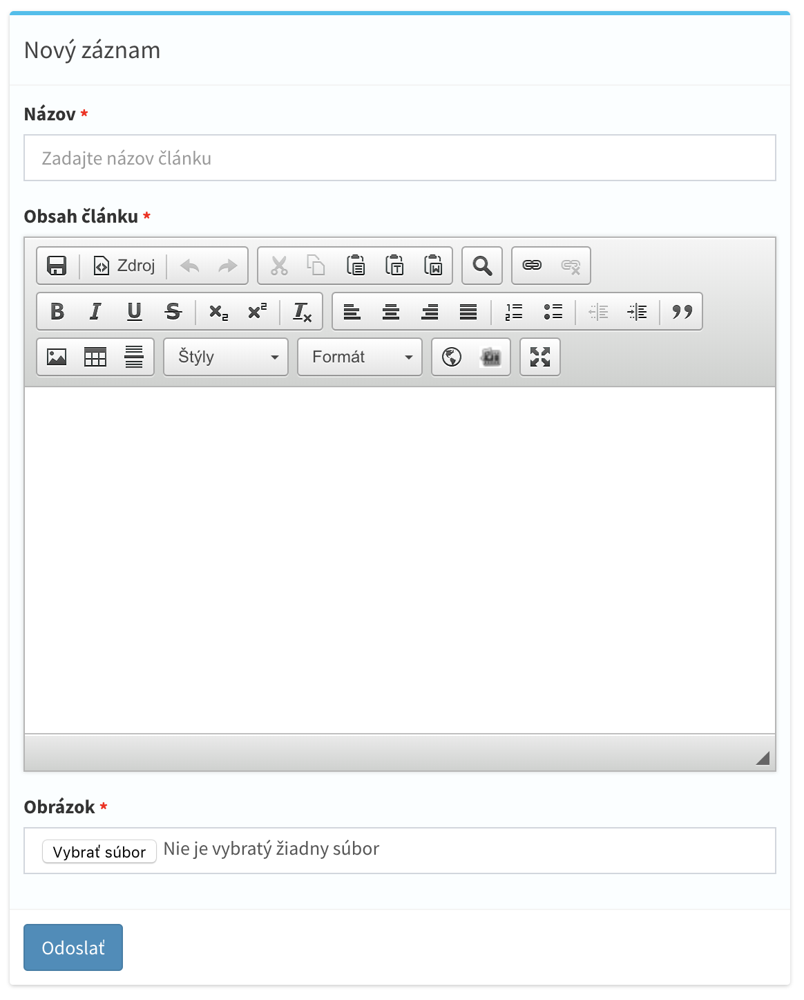

# Zoznam vstupných hodnôt
Základna konfigurácia Admin Modelu pozostáva zo vstupných hodnôt, ktoré reprezentujú informácie o všetkých stĺpcoch v databáze,
pravidla validácie formulárov, reláciach a nastavení gerenovania administračného rozhrania od formulárov, až po tabuľky výpisu.

- [Konfigurácia vstupných hodnôt](#Konfigurácia-vstupných-hodnôt)
- [Zoznam dostupných vstupov](#Zoznam-dostupných-vstupov)

!> Databáza je automatický synchronizovaná pri každej úprave vstupných hodnôt pomocou automatických migrácii

<hr>

## Konfigurácia vstupných hodnôt
Skladá sa z viac rozmerného poľa definovaným vlastnosťou `fields`, ktorá je uložená v Admin Modeli, kde každý kľúč v poli označuje názov stĺpca v databáze a hodnota reprezentuje
konfiguráciu vstupného parametru v spojení s pravidlami [Laravel validácie](https://laravel.com/docs/master/validation#rule-unique).

Konfigurácia môže mať 2 podoby. Jedná z ních je vo formáte poľa,
druhá vo forme reťazcu parametrov oddelených znakom `|`. Nižšie sú znázornene tieto 2 príklady.
Prve 2 položky `name` a `content` označujú vstupné hodnoty pre
názov a obsah. Tretí parameter image je vstup pre nahranie obrázku.

##### Zápis v podobe stringu
Tento zápis sa odporúča pre všetky formy písania vstupných hodnôt.

```php
protected $fields = [
    'name' => 'name:Názov|placeholder:Zadajte názov článku|type:string|required|max:90',
    'content' => 'name:Obsah článku|type:editor|required',
    'image' => 'name:Obrázok|type:file|image|required',
];
```

##### Rovnaký zápis v podobe poľa
Nodporúčaný zápis, z dôsledku veľkého množstvá riadkov v súbore pri modeloch, ktoré obsahujú desiatký vstupných hodnôt. Odporúčana forma zápisu vstupných hodnôt je kombinovanie oboch zápísov, kde v niektorých prípadoch je nutné použiť pravidlá pre validáciu záznamov vo forme [Rules z laravelu](https://laravel.com/docs/5.7/validation#custom-validation-rules).

```php
protected $fields = [
    'name' => [
        'name' => 'Názov',
        'placeholder' => 'Zadajte názov článku',
        'type' => 'string',
        'required' => 'true',
        'max' => 90,
    ],
    'content' => [
        'name' => 'Obsah článku',
        'type' => 'editor',
        'required' => 'true',
    ],
    'image' => [
        'name' => 'Obrazok',
        'type' => 'file',
        'required' => true,
        'image' => true,
    ]
];
```

##### Vygenerované rozhranie na základe konfigurácie


##### Komplexný zápis vstupných hodnôt vo forme metódy

V niektorých prípadoch je potrebné validáciu rozlíšiť pri vytvárani nového záznamu a úprave už existujúceho,
v tomto prípade parameter `$row` bude pri editácii obsahovať editovaný záznam z databázy.

```php
use Illuminate\Validation\Rule;

public function fields($row)
{
    return [
        'username' => 'name:Meno a priezvisko|required|max:30',
        'email' => 'name:Email|email|required|unique:users,email,'.( $row ? $row->getKey() : 'NULL' ),
        'password' => 'name:Heslo|type:password|confirmed|min:4|'.( ! $row ? 'required' : '' ),
        'countries' => 'name:Krajina|type:select',

        'other_field' => [
            'name' => 'Vstupná hodnota X Y',
            'required' => $row ? false : true,
            Rule::unique('users')->ignore( $row ? $row->id : null ),
        ],
    ]
}
```

<hr>

## Zoznam dostupných vstupov

<!-- -->
#### (fa-font) Textový vstup
Textové pole reprezentované klasickým input vstupom.

`type:string`

Pri vytvárani vstupného poľa s týmto typom nie je povinné zadávať parameter type:string, kedže každé vstupné pole ma preddefinovanú hodnotu tohto typu, takže táto hodnota bude vyplnená automaticky.

<hr>

<!-- -->
#### (fa-text-width) Dlhší text
Textové pole reprezentované textarea vstupom.

`type:text` alebo `type:longtext` pre podporu dĺžky typu longtext textov v databáze.

<hr>

<!-- -->
#### (fa-file-word-o) Textový editor
Vstup vo formáte [CKEditoru](https://ckeditor.com/) pre jednoduché formátovanie textu.

`type:editor` alebo `type:longeditor` pre podporu dĺžky typu longtext textov v databáze.

<hr>

<!-- -->
#### (fa-sort-numeric-desc) Celé číslo
Vstup vo formáte celého čísla.

`type:integer`

<hr>

<!-- -->
#### (fa-sort-numeric-desc) Desatinné číslo
Vstup vo formáte desatinného čísla.

`type:decimal`

<hr>

<!-- -->
#### (fa-check-square-o) Checkbox
Vstup vo formáte aktívnej alebo neaktívnej hodnoty.

`type:checkbox`

<hr>

<!-- -->
#### (fa-key) Password
Vstup vo formáte skytej hodnoty typu hesla.

`type:password`

<hr>

<!-- -->
#### (fa-list-ol) Select
Výber jednej hodnoty zo zoznamu.

`type:select`

Výber z viacerých hodnôt zo zoznamu.

`type:select|mutliple`

**Dosadzovanie hodnôt do zoznamu**

Hodnoty je možné dosadzovať troma spôsobmi. Ako prvé je využitie parametru `options` hneď v parametri daného vstupného poľa, kde ako vlastnosť parametru budú reprezentované hodnoty v zozname, predelené čiarkou.

`type:select|options:Hodnota 1,Hodnota 2,Hodnota 3`

**Ďalšia z možností je definovanie kľúčov a hodnôt vo vlastnosti `$options` v Admin Modeli.**
```php
protected $options = [
     'countries' => [
          'sk' => 'Slovakia',
          'cs' => 'Czech republic',
          ...
     ],
     'other-select' => [
          'yes' => 'Áno',
          'no' => 'Nie'
     ]
];
```

**Pre dynamický generované vstupné hodnoty využijeme metodu options:**
```php
public function options()
{
     return [
         'countries' => App\Country::pluck('country', 'code')->toArray()
         'other-select' => [
            'yes' => 'Áno',
            'no' => 'Nie'
         ]
     ];
}
```

<hr>

<!-- -->
#### (fa-circle-o) Radio
Vstup vo formáte viacerých možnosti na výber typu radio input.

`type:radio`

Pre dosadzovanie hodnôt v zozname typu radio, sa využíva rovnaký postup ako pri vstupe typu select, s použitím parametru *options* so všetkými formami zápisu.

<hr>

<!-- -->
#### (fa-database) Relácie
Podpora načítania hodnôt do selectu alebo multiselectu z existujúcich záznamov v ľubovoľenj tabuľke v databáze.

Ako prvá hodnota parametru je reprezentovaný názov tabuľky v databáze, druhá hodnota reprezentuje názov stĺpca, z ktorého budú dáta v zozname vypísane používateľovi.

**One to One / Many to One**

`belongsTo:users,name`

**Many to Many**

`belongsToMany:users,name`

Pre kombináciu stĺpcov vo výpise s vlastným textom je možné použiť dosadzovanie stĺpcov pomocou dvojbodky a názvu stĺpca v databáze v kombinácii spolu s vlastným textovým formátom.

`belongsTo:users,:firstname :lastname - Vek :age`

!> Viac o reláciach nájdete v sekcii [Databázové relácie](model-relations.md#databázové-relácie)

<hr>

<!-- -->
#### (fa-upload) Upload súborov
Možnost pridania vstupu vo forme nahrávania súboru, či obrazkú s automatických orezávaním.

`type:file`

Pre upload viacero súborov zároveň je dostupný parameter `multiple`.

<hr>

<!-- -->
#### (fa-calendar) Dátum a čas
Podpora formátovaného vstupu vo forme dátumu a času.

Pre format dátumu:

`type:date`

Pre format samostatného času:

`type:time`

Pre format dátumu a času zároveň:

`type:datetime`

Pre výber viacero dátumov naraz, je dostupný voliteľný parameter `multiple`.

Pre upravu formatu dátumu, je dostupný voliteľný parameter s vlastnou hodnotou `format:d.m.Y`.
