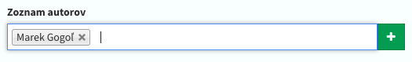

# Vstupné polia
Základna konfigurácia Admin Modelu pozostáva zo vstupných polí, ktoré reprezentujú informácie o všetkých stĺpcoch v databáze,
pravidla validácie formulárov, reláciach a nastavení gerenovania administračného rozhrania od formulárov, až po tabuľky výpisu.

- [Zápis vstupných polí](#Zápis-vstupných-polí)
- [Zoznam vstupných polí](#Zoznam-vstupných-polí)
- [Parametre vstupných polí](#Parametre-vstupných-polí)
- [Vlastné vstupné polia](#vlastné-vstupné-polia)
- [Usporiadanie vstupov do skupín](#usporiadanie-vstupov-do-skupín)
- [Usporiadanie vstupov do tabov](#usporiadanie-vstupov-do-tabov)

!> Databáza je automatický synchronizovaná pri každej úprave vstupných polí, pomocou automatických migrácii s príkazom `php artisan admin:migrate`

<hr>

## Zápis vstupných polí
Skladá sa z viac rozmerného poľa definovaným vlastnosťou `fields`, ktorá je uložená v Admin Modely, kde každý kľúč v poli označuje názov stĺpca v databáze a hodnota reprezentuje konfiguráciu vstupného parametru v spojení s pravidlami [Laravel validácie](https://laravel.com/docs/master/validation#rule-unique).

Konfigurácia môže mať 2 podoby. Jedná z ních je vo formáte poľa,
druhá vo forme reťazcu parametrov oddelených znakom `|`. Nižšie sú znázornene tieto 2 príklady.
Prvé 2 položky `name` a `content` označujú vstupné polia pre
názov a obsah. Tretí parameter image je vstup pre nahránie obrázku.

##### Zápis v podobe stringu
Tento zápis sa odporúča pre všetky formy písania vstupných polí.

```php
protected $fields = [
    'name' => 'name:Názov|placeholder:Zadajte názov článku|type:string|required|max:90',
    'content' => 'name:Obsah článku|type:editor|required',
    'image' => 'name:Obrázok|type:file|image|required',
];
```

##### Rovnaký zápis v podobe poľa
Nodporúčaný zápis, z dôsledku veľkého množstvá riadkov v súbore pri modeloch, ktoré obsahujú desiatký vstupných polí.

```php
protected $fields = [
    'name' => [
        'name' => 'Názov',
        'placeholder' => 'Zadajte názov článku',
        'type' => 'string',
        'required' => 'true',
        'max' => 90,
    ],
    'content' => [
        'name' => 'Obsah článku',
        'type' => 'editor',
        'required' => 'true',
    ],
    'image' => [
        'name' => 'Obrazok',
        'type' => 'file',
        'required' => true,
        'image' => true,
    ]
];
```

##### Vygenerované rozhranie na základe konfigurácie


##### Komplexný zápis vstupných hodnôt vo forme metódy

V niektorých prípadoch je potrebné validáciu podmienkovo rozlíšiť pri vytvárani nového záznamu a taktiež pri úprave už existujúceho záznamu, v tomto prípade parameter `$row` bude pri editácii obsahovať editovaný záznam z databázy.

Tento zápis textovej podoby vstupných polí s kombináciou poľa je odporúčana forma zápisu vstupných polí, v prípadoch ak je nutné použiť komplexnejšie pravidlá pre validáciu záznamov vo formulári pomocou [rules z laravelu](https://laravel.com/docs/master/validation#custom-validation-rules).

```php
use Illuminate\Validation\Rule;

public function fields($row)
{
    return [
        'username' => 'name:Meno a priezvisko|required|max:30',
        'email' => 'name:Email|email|required|unique:users,email,'.( $row ? $row->getKey() : 'NULL' ),
        'password' => 'name:Heslo|type:password|confirmed|min:4|'.( ! $row ? 'required' : '' ),
        'countries' => 'name:Krajina|type:select',

        'other_field' => [
            'name' => 'Vstupná hodnota X Y',
            'required' => $row ? false : true,
            Rule::unique('users')->ignore( $row ? $row->id : null ),
        ],
    ]
}
```

<hr>

## Zoznam vstupných polí

<!-- -->
#### (fa-font) Textový vstup
Textové pole reprezentované klasickým input vstupom.

`type:string`

Pri vytvárani vstupného poľa s týmto typom nie je povinné zadávať parameter type:string, kedže každé vstupné pole ma preddefinovanú hodnotu tohto typu, takže táto hodnota bude vyplnená automaticky.

<hr>

<!-- -->
#### (fa-text-width) Dlhší text
Textové pole reprezentované textarea vstupom.

`type:text` alebo `type:longtext` pre podporu dĺžky typu longtext textov v databáze.

<hr>

<!-- -->
#### (fa-file-word-o) Textový editor
Vstup vo formáte [CKEditoru](https://ckeditor.com/) pre jednoduché formátovanie textu.

`type:editor` alebo `type:longeditor` pre podporu dĺžky typu longtext textov v databáze.

<hr>

<!-- -->
#### (fa-sort-numeric-desc) Celé číslo
Vstup vo formáte celého čísla.

`type:integer`

<hr>

<!-- -->
#### (fa-sort-numeric-desc) Desatinné číslo
Vstup vo formáte desatinného čísla.

`type:decimal`

<hr>

<!-- -->
#### (fa-check-square-o) Checkbox
Vstup vo formáte aktívnej alebo neaktívnej hodnoty.

`type:checkbox`

<hr>

<!-- -->
#### (fa-key) Password
Vstup vo formáte skytej hodnoty typu hesla.

`type:password`

<hr>

<!-- -->
#### (fa-list-ol) Select
Výber jednej hodnoty zo zoznamu.

`type:select`

Výber z viacerých hodnôt zo zoznamu.

`type:select|mutliple`

**Dosadzovanie hodnôt do zoznamu**

Hodnoty je možné dosadzovať troma spôsobmi. Ako prvé je využitie parametru `options` hneď v konfigurácii daného vstupného poľa, kde ako hodnota parametru budú reprezentované položky v zozname, predelené čiarkou.

`type:select|options:Hodnota 1,Hodnota 2,Hodnota 3`

**Ďalšia z možností je definovanie kľúčov a hodnôt vo vlastnosti `$options` v Admin Modely.**
```php
protected $options = [
     'countries' => [
          'sk' => 'Slovakia',
          'cs' => 'Czech republic',
          ...
     ],
     'other-select' => [
          'yes' => 'Áno',
          'no' => 'Nie'
     ]
];
```

**Pre dynamický generované vstupné hodnoty využijeme metodu options:**
```php
public function options()
{
     return [
         'countries' => App\Country::pluck('country', 'code')->toArray()
         'other-select' => [
            'yes' => 'Áno',
            'no' => 'Nie'
         ]
     ];
}
```

<hr>

<!-- -->
#### (fa-circle-o) Radio
Vstup vo formáte viacerých možnosti na výber typu radio input.

`type:radio`

Pre dosadzovanie hodnôt v zozname typu radio, sa využíva rovnaký postup ako pri vstupe typu select, s použitím parametru *options* so všetkými formami zápisu.

<hr>

<!-- -->
#### (fa-database) Relácie
Podpora načítania hodnôt do selectu alebo multiselectu z existujúcich záznamov v ľubovoľnej tabuľke z databázy.

Ako prvá hodnota parametru je reprezentovaný názov tabuľky v databáze, druhá hodnota reprezentuje názov stĺpca, z ktorého budú dáta v zozname vypísane používateľovi.

**One to One / Many to One**

`belongsTo:users,name`

**Many to Many**

`belongsToMany:users,name`

**Kombinácia stĺpcov vo výpise zoznamu**

Pre kombináciu stĺpcov v zozname s výpisom, je možné použiť dosadzovanie stĺpcov pomocou dvojbodky a názvu stĺpca v databáze v kombinácii s vlastným textovým formátom.

`belongsTo:users,:firstname :lastname - Vek :age`

**Prepojenie relačného vstupu s rozhránim pre správu relačných záznamov**

V prípade, ak chcete vstupné pole prepojiť s rozhraním pre pridávanie nových položiek do zoznamu. Môžete použiť parameter `canAdd`, ktorý povolí dynamické vkladanie záznamov priamo z daného vstupného poľa.

`belongsTo:users,:username|canAdd`



**Filtrácia záznamov vo vstupnóm poli**

V prípade, ak potrebujete filtrovať záznamy v zozname položiek na výber, je možné použiť parameter `filterBy`, ktorý na základe hodnoty z iného vstupného poľa vyfiltruje položky v aktuálnom zozname.

`filterBy:field_name,row_column`

!> Všetko o týchto reláciach a ich ďalších nastaveniach nájdete v sekcii [Databázové relácie](model-relations.md#priradenie-relácie-vo-vstupnóm-poli)

<hr>

<!-- -->
#### (fa-upload) Upload súborov
Možnost pridania vstupu vo forme nahrávania súboru, či obrazkú s automatických orezávaním.

`type:file`

!> Pre upload viacero súborov zároveň do jedného vstupného poľa je dostupný parameter `multiple`.

!> V prípade, ak model obsahuje iba jedno vstupné pole s typom nahrávania súborov, či obrázkov, je možné využiť parameter `multirows`. Tento parameter po odoslaní formulára s viacerými súbormi, vytvori rozdielne záznamy pre každý z nahraných súborov.

<hr>

<!-- -->
#### (fa-calendar) Dátum a čas
Podpora formátovaného vstupu vo forme dátumu a času.

Pre format dátumu:

`type:date`

Pre format samostatného času:

`type:time`

Pre format dátumu a času zároveň:

`type:datetime`

Pre výber viacero dátumov, alebo časov naraz, je dostupný voliteľný parameter `multiple`.

Pre upravu formatu dátumu, je dostupný voliteľný parameter s vlastnou hodnotou `format:d.m.Y`.

<hr>

## Parametre vstupných polí

Všetky vstupné polia taktiež zahrňujú dodatočnú konfiguráciu, ktorá je dostupná pomocou doplnkových globalných atribútov. Medzi základne parametre vstupných polí patri konfigurácia [laravel validácie](https://laravel.com/docs/master/validation#available-validation-rules), ktorú je možné skombinovať so všetkými vstupnými poliami.

V nasledujúcom zozname nájdete všetky dostupné parametre, ktoré CrudAdmin poskytuje pri vytvrárani vstupných polí.

### Parametre pre formuláre

##### Názov vstupného poľa `(Povinné)`
`name:Názov článku`

##### Typ vstupného poľa `(Povinné)`
`type:string`

##### Popis vstupného poľa
Popis vstupného poľa je znázornený malým textom pod daným vstupom.

`title:Zadajte tel. číslo v tvare +421 xxx xxx xxx`

##### Placeholder vstupného poľa
Placeholder je umiestnený v danóm vstupnóm poli pri prázdnej hodnote.

`placeholder:Zadajte tel. číslo v tvare +421 xxx xxx xxx`

##### Deaktivovanie vstupného poľa vo formulári
`disabled`

##### Predvolená hodnota vstupného poľa
`default:10`

V prípade, ak ide o vnorený model, je možné použiť predvolenú hodnotu rodičovského záznamu.

`default:$parent.name` alebo `default:table_name.name`

##### Odstránenie vstupného poľa z formulára
Pole bude úplne vynechané, tým pádom sa nebude nachádzať ani jeho hodnota v odoslanom requeste.

`removeFromForm`

##### Skrytie vstupného poľa z formulára
Pole bude dostupné vo formulári a taktiež v danóm odoslanom requeste, no bude neviditeľné pre používateľa.

`hideFromForm`

##### Skrytie vstupného poľa z formulára len pri vytvárani záznamu
`hideOnCreate`

##### Skrytie vstupného poľa z formulára len pri úprave záznamu
`hideOnUpdate`

##### Vlastná VueJS komponenta vstupného poľa
`component:MyComponentName`

!> Viac o vlastných komponentách vstupných polí nájdete v odseku [Vlastné vstupné polia](model-fields.md#vlastné-vstupné-polia)

##### Nahravanie súborov ako samostatný záznam v databáze
V prípade, ak model obsahuje iba jedno vstupné pole s typom nahrávania súborov, či obrázkov, je možné využiť nasledujúci parameter. Tento parameter po odoslaní formulára s viacerými súbormi, vytvori rozdielne záznamy pre každý z nahraných súborov.

`multirows`

##### Viac jazyčné vstupné pole
Viac jazyčné vstupné pole je možné povoliť pomocou parametru locale, ktorý automatický prepne typ poľa na **JSON**, v ktorom budú reprezentované hodnoty jazykových mutácii daného poľa.

`locale`

!> Viac o týchto jazykových mutáciach sa dozviete v sekci [Zkrkadlenie obsahu](languages.md#_2-zrkadlenie-obsahu-preklad-konkretných-stĺpcov)

##### Relácia One to One
`belongsTo:users,username`

!> Viac o týchto reláciach nájdete v sekcii [Databázové relácie](model-relations.md#priradenie-relácie-vo-vstupnóm-poli)

##### Relácia Many to Many
`belongsToMany:users,username`

!> Viac o týchto reláciach nájdete v sekcii [Databázové relácie](model-relations.md#priradenie-relácie-vo-vstupnóm-poli)

##### Povolenie vkládania nových záznamov vo vstupných poli typu relácie
`canAdd`

!> Viac o tomto nastavení nájdete v sekcii [Databázové relácie](model-relations.md#prepojenie-vstupného-poľa-s-rozhraním-pre-pridavanie-nových-záznamov)

##### Možnosti pre vstupné pole typu select a radio
`options:Apple,Banana,Strawberry`

##### Podpora viacnasobného zvolenia hodnoty vo vstúpnom polí
Atribút podporuje vstupné polia typu `select`, `file`, `date`, `time`.

`multiple`

##### Filtrácia možnosti na základe iného vstupného poľa
Atribút podporuje vstupné polia typu `select`, `belongsTo` alebo `belongsToMany`.

`filterBy:field_name,database_column_name`

!> Viac o filtrácii sa dozviete v sekcii [Nastavenia relácii vo vstupnóm poli](model-relations.md#Nastavenia-relácii-vo-vstupnóm-poli)

##### Predvyplnenie poľa na základe hodnoty z relácie ineho poľa
`fillBy:field_name,database_column_name`

!> Viac o predvyplniani hodnôt sa dozviete v sekcii [Databázove relácie](model-relations.md#predvyplnianie-hodnôt-z-relačného-vstupného-poľa)

### Parametre pre tabuľku s výpisom záznamov

##### Skývanie hodnoty z tabuľky s výpisom záznamov
`hidden`

##### Skrývanie vstupného poľa v tabuľke s výpisom záznamov a taktiež vo formulári
Úplne zneviditeľnenie vstupného poľa a stĺpca.

`invisible`

##### Nastavenie limitu znakov v tabuľke s výpisom dát
`limit:50`

##### Nastavenie predvoleného zoradenie záznamov podľa daného stĺpca
`orderBy:asc` / `orderBy:desc`

##### Klikateľne tel. číslo
Stĺpec v tabuľke výpisu záznamov bude obsahovať klikateľný odkaz s presmerovaním na akciu telefonátu.

`phone_link`

##### Vlastny názov stĺpca vo výpise záznamov
V prípade ak sa názov stĺpca vo formulári nezhoduje s názvom stĺpca v tabuľke záznamov.

`column_name:My other column title`

### Databázove nastavenia stĺpcov

##### SQL atríbút pre uníkatne záznamy
`unique_db`

##### SQL atríbút pre indexovanie stĺpca
`index`

##### SQL atríbút pre kladne čísla
`unsigned`

##### Imaginarné vstupné pole
Ide o vstupné pole vo formulári, ktoré nebude mať žiaden dopad ani prepojenie na databázu. Využíva sa v prípade pomocného vstupného poľa, či vlastnej komponenty, ktorá nevyžaduje ukládať žiadné hodnoty do databázy.

`imaginary`

### Ostatné parametre

##### Aplikovanie parametrov len v administrácii
`inAdmin:required` / `inBackend:required`

##### Aplikovanie parametrov len vo frontende
`inFrontend:required`

##### Aplikovanie parametrov len vo konzole
`inConsole:required`

<hr>

## Vlastné vstupné polia

V niektorých prípadoch potrebujete vytvoriť vlastné vstupné polia. S touto situáciou nemá CrudAdmin žiaden problém ani obmedzenie, a plne poskytuje funkcionalitu vytvorenia vlastného poľa na mieru, ktoré je reaktívne a kuztomitovateľné podľa požiadavok programátora.

Vytváranie poľa pozostáva z dvoch jednoduchých krokov. Ako prvé je potrebné vytvoriť vlastnú **VueJS** komponentu pomocou `artisan` príkazu

```
php artisan admin:component MyCustomField
```

Následne sa vytvori súbor komponenty **resources/views/admin/components/MyCustomField.vue** ktorý pozostáva konfiguráciou vašej komponenty. Predvolená komponenta obsahuje funkčnú šablónu vstupného poľa, ktorú môžete pomocou VueJS plne kustomizovať.

Následne je potrebné komponentu priradiť vstupnému poľu, kde si prajete vygenerovanú komponentu aplikovať. Vstupné pole vytvorite klasickým spôsobom, s požadovaným typom daného poľa. A následne jej priradite parameter `component:MyCustomField`, ktorý bude automatický načítany z globálnej zložky komponent.

```php
protected $fields = [
    'my_custom_field' => 'name:Moje pole|type:string|component:MyCustomField|required'
];
```

Komponenta sa skladá z klasickej štruktúry písania **VueJs** komponent. Obsahuje jeden blok v `<template>` elemente, ktorý zahŕňa HTML kód komponenty. Následne v druhej časti komponenta pozostáva z **JavaScript** logiky správania a generovania komponenty, ktorá je uložena v  `<script>` elemente. CrudAdmin následne tieto dva elementy naparsuje, a vyrenderuje bez potreby kompilovania kódu.

```html
<template>
    <div class="form-group">
        <label>{{ field.name }}</label>

        <input
            type="text"
            placeholder="Wohoo,,, this is my first custom component field!!"
            class="form-control"
            :name="field_key"
            :value="value"
            @keyup="onChange">

        <button type="button" class="btn btn-primary" @click="hideMyField">Hide my field</button>
    </div>
</template>

<script type="text/javascript">
export default {
    props : [ 'field_key', 'field', 'row' ],

    mounted(){
        console.log('my wohooo component is mounted!');
    },

    computed : {
        //Get input value
        value(){
            return this.field.value || this.field.default;
        },
    },

    methods : {
        //Update input value
        onChange(e){
            this.field.value = e.target.value;
        },
        hideMyField(){
            this.$set(this.field, 'hideFromForm', true);
        },
    }
}
</script>
```

!> VueJS komponenty netreba žiadným spôsobom kompilovať. CrudAdmin načíta automaticky VueJS komponenty, a vyrenderuje ich.

<hr>

## Usporiadanie vstupov do skupín

Vstupné polia je možné usporiadavať a prerozdeľovať do skupín, vďaka čomu vieme spriehľadniť zložitejšie formuláre s väčším množstvom vstupných polí.

Skupinu vytvorime vložením vstupných hodnôt do jednej metódy z triedy `Gogol\Admin\Fields\Group`, ktorá je dostupná v každom vytvorenom admin modely.

!> Skupine je možné nastaviť názov, jednoduchšie orientovanie vo formulári. Názov je možné definovať dvoma spôsobmi, ako prvý je vloženim do kľúča poľa a druhý je pomocou metódy `name()`.

!> Skupine je možné nastaviť taktiež ikonu pomocou metódy `icon('fa-truck')`. Zoznam dostupných ikón nájdete v dokumentácii [Font Awesome 4](https://fontawesome.com/v4.7.0/icons/)

!> V prípare zložitejšiej práce so skupinou, je možné skupine definovať identifikátor skupiny pomocou metódy `id('my-id')`, na ktoré vieme aplikovať CSS štýly, poprípade vieme dynamicky upravovať vstupné polia v skupine.

?> Všetky skupiny je možné donekonečná rekurzívne zanorovať.

##### 1. Základna skupina so 100% šírkou

V tomto príklade su znázornené taktiež 2 spôsoby definovania názvu skupiny.

```php
public function fields()
{
    return [
        'name' => 'name:Názov článku|type:string',
        'Parametre' => Group::fields([
            'updated_at' => 'name:Dátum upravenia|type:date',
            'created_at' => 'name:Dátum vytvorenia|type:date',
        ]),
        Group::fields([
            'a' => 'name:Pole a',
            'b' => 'name:Pole b',
        ])->name('Ostatné parametre')->icon('fa-cog'),
    ];
}
```


##### 2. Skupina s 50% šírkou (col-md-6)
```php
public function fields()
{
    return [
        'name' => 'name:Názov článku|type:string',
        'Parametre' => Group::half([
            'updated_at' => 'name:Dátum upravenia|type:date',
            'created_at' => 'name:Dátum vytvorenia|type:date',
        ]),
        'Ostatné parametre' => Group::half([
            'a' => 'name:Pole a',
            'b' => 'name:Pole b',
        ])->icon('fa-cog'),
    ];
}
```


##### 3. Skupina s 33% šírkou (col-md-4)
```php
public function fields()
{
    return [
        'name' => 'name:Názov článku|type:string',
        'Parametre' => Group::third([
            'updated_at' => 'name:Dátum upravenia|type:date',
            'created_at' => 'name:Dátum vytvorenia|type:date',
        ]),
        'Ostatné parametre' => Group::third([
            'a' => 'name:Pole a',
            'b' => 'name:Pole b',
        ])->icon('fa-cog'),
        'Dodatkové parametre' => Group::third([
            'c' => 'name:Pole c',
            'd' => 'name:Pole d',
        ])->icon('fa-cog'),
    ];
}
```


##### 4. Skupina s vlastnou šírkou

Širku skupiny je možné taktiež definovať dynamicky pomocou metódy `width()`, a vyskladať tak vlastný grid, ktorý je rozdelený na 12 častí.

```php
public function fields()
{
    return [
        'name' => 'name:Názov článku|type:string',
        'Parametre' => Group::fields([
            'updated_at' => 'name:Dátum upravenia|type:date',
            'created_at' => 'name:Dátum vytvorenia|type:date',
        ])->width(8),
        'Ostatné parametre' => Group::fields([
            'a' => 'name:Pole a',
            'b' => 'name:Pole b',
        ])->icon('fa-cog')->width(4),
    ];
}
```


##### 5. Skupina so vstupnými hodnotami v jednom riadku

Ak potrebujete automaticky všetky vstupné hodnoty zarovnať do jedneho riadku veďla seba, k tomu slúži metóda `inline()`.

```php
public function fields()
{
    return [
        'name' => 'name:Názov článku|type:string',
        'Parametre' => Group::fields([
            'updated_at' => 'name:Dátum upravenia|type:date',
            'created_at' => 'name:Dátum vytvorenia|type:date',
        ])->inline(),
    ];
}
```


##### 6. Rekurzívne skupiny

Všetky skupiny je možné donekonečna rekurzívne zanorovať, vďaka čomu vieme vytvárať komplexné a zložite formuláre.

```php
public function fields()
{
    return [
        'name' => 'name:Názov článku|type:string',
        'Parametre' => Group::fields([
            'updated_at' => 'name:Dátum upravenia|type:date',
            'created_at' => 'name:Dátum vytvorenia|type:date',
            'Ostatné parametre' => Group::half([
                'a' => 'name:Pole a',
                'b' => 'name:Pole b',
            ])->icon('fa-car'),
            'Dodatkové parametre' => Group::half([
                'c' => 'name:Pole c',
                'd' => 'name:Pole d',
            ])->icon('fa-cog'),
        ]),
        'z' => 'name:Field z|type:string',
    ];
}
```


<hr>

## Usporiadanie vstupov do tabov

Vstupné polia je možné usporiadavať a prerozdeľovať do tabov, vďaka čomu vieme spriehľadniť zložitejšie formuláre s väčším množstvom vstupných polí.

!> Tak isto ako skupinám, aj tabom je možné rovnakými spôsobmi nastaviť názov.

!> Skupine je taktiež možné nastaviť ikonu pomocou metódy `icon('fa-truck')`. Zoznam dostupných ikón nájdete v dokumentácii [Font Awesome 4](https://fontawesome.com/v4.7.0/icons/)

!> Všetky taby je možné donekonečná rekurzívne zanorovať a plné kombínovať so skupinamy.

##### 1. Zobrazenie tabov v kombinácii so skupinami

```php
public function fields()
{
    return [
        'name' => 'name:Názov článku|type:string',
        'Parametre' => Group::tab([
            'updated_at' => 'name:Dátum upravenia|type:date',
            'created_at' => 'name:Dátum vytvorenia|type:date',
        ]),
        'Ostatné parametre' => Group::tab([
            'a' => 'name:Pole a',
            'b' => 'name:Pole b',

            'Moja skupina v tabe' => Group::fields([
                'x' => 'name:Pole x|type:date',
                'y' => 'name:Pole y|type:date',
            ]),
        ])->icon('fa-cog'),
        'Dodatkové parametre' => Group::tab([
            'c' => 'name:Pole c',
            'd' => 'name:Pole d',
        ])->icon('fa-car'),
    ];
}
```


##### 2. Vytvorenie tabu z Admin Modelu

K jednoduchým tabom zložených zo vstupných hodnôt vieme pridať tab, ktorý bude obsahovať kompletné rozšírenie Admin Modelu.
> Ak váše dieťa modelu obsahuje reláciu `$belongsToModel` k modelu v ktorom definujete taby, tak v tomto prípade viete priradiť dany relačný podmodel do konkretného tabu.

> Do tabu je taktiež možné priradiť model, ktorý neobsahuje žiadné relácie s daným modelom v ktorom definujete taby.

```php
use App\Author;

public function fields()
{
    return [
        'name' => 'name:Názov článku|type:string',
        'Parametre' => Group::tab([
            'updated_at' => 'name:Dátum upravenia|type:date',
            'created_at' => 'name:Dátum vytvorenia|type:date',
        ]),
        'Upraviť autorov článku' => Group::tab(Author::class)
    ];
}
```

