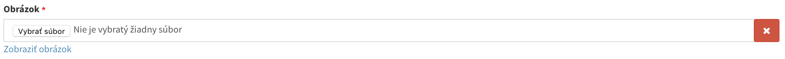
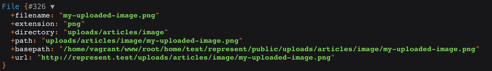

# Práca s obrázkami a súbormi

Systém CrudAdmin plne automatizoval nahrávanie súborov a obrázkov do administrácie. Veľa krát je ako ďalší krok potrebné tieto obrázky zmenšovať. K tomu rozšírenie sprístupnilo jednoduchú nadstavbu, pomocou ktoréj je práca s obrázkami a súbormi jednoduchšia ako nikdý pred tým.

- [Nahravanie súboru, obrázku](#nahravanie-súboru-obrázku)
- [Výber súboru z modelu](#výber-súboru-z-modelu)
- [Orezávanie a práca s obrázkom](#orezávanie-a-práca-s-obrázkom)
- [Zložitejšie úkony s obrázkami](#zložitejšie-úkony-s-obrázkami)
- [Ďalšie pomocné funkcie](#Ďalšie-pomocné-funkcie)

## Nahravanie súboru, obrázku

Pre jednoduché nahravanie súborov stačí v modeli zadefinovať vstup súboru.

```php
protected $fields = [
    'image' => 'name:Obrázok|type:file|image'
];
```

Rozhranie následne automatický vygenerujé vstup pre nahrávanie súborov s patričnou validáciou, a zaobstará bezpečný prenos súboru až na server.



## Výber súboru z modelu

```php
$article = Article::find(1);

$image = $article->image;
```

Premenná `$image` obsahuje obrázok reprezentovaný triedou [Gogol\Admin\Helpers\File](https://github.com/MarekGogol/crudadmin/blob/master/src/Helpers/File.php), ktorá sa postará v šablone o jednoduchý výpis a ďalšiu zjednodušenú prácu so súborom.



Trieda automatický pri výpise v šablone automatický vráti plnú cestu k súboru na servery.

```blade
<article>
    <h2>{{ $article->image }}</h2>
    image }}" alt="">
</article>
```

Výsledok v atribúte `src` bude plná cestá k súboru *https://example.com/uploads/.../my-uploaded-file.png*

## Orezávanie a práca s obrázkom

Trieda [Gogol\Admin\Helpers\File](https://github.com/MarekGogol/crudadmin/blob/master/src/Helpers/File.php) automatický poskytuje orez obrázkov, ktorý je možné vykonávať priamo v šablone.

K orezu obrázkov slúži metóda `resize($width, $height)`, kde ako prvý parameter príjma šírku, a druhy výšku obrázku. Ak su definované oba parametre šírka a výška, bude sa obrázok orezávať v správnom pomere, ak je definovaná len jedna konštatna, obrázok ďalšiu veličinu dopočíta v správnom pomere.

```blade
<article>
    <h2>{{ $article->image }}</h2>
    image->resize(200, 100) }}" alt="">
</article>
```

!> Pri prvóm načítaní obrázku bude vykonaný orez súboru a jeho uloženie na server pre budúce požiadavky na tento orezaný súbor. O to všetko sa postará plne automatický system CrudAdmin.

## Zložitejšie úkony s obrázkami

Trieda [Gogol\Admin\Helpers\File](https://github.com/MarekGogol/crudadmin/blob/master/src/Helpers/File.php) využíva rozšírenie http://image.intervention.io/ , pomocou ktorého automatický dokáže robiť aj zložitejšie úkony s obrázkom, ktoré táto knižnica **Intervention Image** podporuje.

K funkciam rozšírenia **Intervention Image** je možné pristúpiť pomocou metódy `image($mutators)`, pričom vstupný parameter tejto funkcie príjma pole s kľúčmi reprezentujúce názvy funkcií a jeho hodnoty ako parametre danej funkcie, ktoré sa maju nad obrázkom vykonať.

```blade
<article>
    <h2>{{ $article->image }}</h2>
    image->image([
        'fit' => [200, 200],
        'blur' => 10
    ]) }}" alt="">
</article>
```

!> V tejto funkcii bol použitý orez obrázku pomocou funkcie `fit` a následne po orezaní obrázku bolo vykonané rozmazanie obrázku s funkciou `blur`.

> Orez obrázku - http://image.intervention.io/api/fit

> Rozmazanie obrázku - http://image.intervention.io/api/blur

## Ďalšie pomocné funkcie

Pre zjednodušenú prácu so súbormi sú dostupné ďalšie funkcie.

##### Vymazanie súboru

`delete()` - metóda sa postará o zmazanie súboru zo servera.

```php
$row->image->delete();
```

##### Stiahnutie súboru zo servera
`download()` - metóda vracia odkaz k súboru na nútene stiahnutie súboru zo servera, v tomto prípade prehliadač automaticky ponukne stiahnutie súboru, namiesto jeho zobrazenia v prehliadači.

```blade
<a href="{{ $row->image->download() }}">Stiahnúť obrázok</a>
```

##### Formatovaná veľkosť súboru
`filesize()` - metóda vracia presnú veľkosť súboru súboru v merných jednotkách B/Kb/Mb/Gb, podľa veľkosti súboru.

```blade
Formatovaná veľkosť súboru je {{ $row->image->filesize() }}
// Formatovaná veľkosť súboru je 120 MB
```

Pre neformatovanú veľkosť súboru je možné použiť rovnaku funkciu s parametrom `false`.

```blade
Neformatovaná veľkosť súboru je {{ $row->image->filesize(false) }}
// Neformatovaná veľkosť súboru je 120000000
```