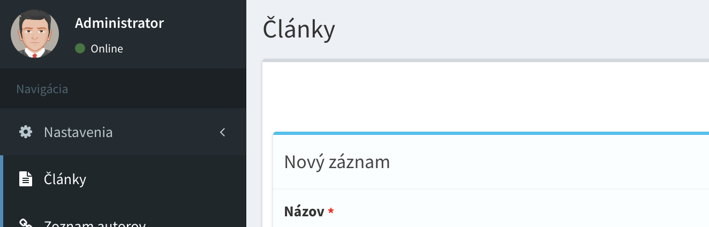
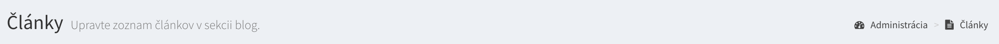
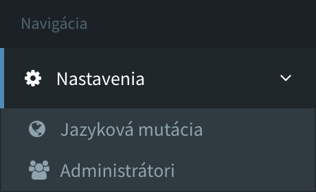

# Konfigurácia

## Parametre a nastavenia
Každý Admin Model pozostáva z parametrov, ktoré definujú správanie generovania sa komponentov v administrácii.
Admin Model po vytvorení obsahuje základné najpoužívanejšie parametre, ktoré môže programátor upraviť, vymazať alebo doplniť.

- [Vstupné hodnoty](#_1-Vstupné-hodnoty)
- [Základné parametre](#_2-Základné-parametre)
- [Obmedzenia obsahu](#_3-Obmedzenia-obsahu)
- [Doplnkové parametre](#_4-Doplnkové-parametre)

!> Pri všetkých konfiguráciach parametrov, ktoré sú reprezentované vytvorením stĺpca v databáze, či zmenu už existujúceho stĺpca alebo jeho vlastnosti, je potrebne vykonať
   automatickú migráciu databázy pomocou príkazu v `php artisan admin:migrate`, ktorý automatický a inteligentne synchronizuje celú relačnú databázu.

---

## 1. Vstupné hodnoty
Zoznam a nastavenie všetkých stĺpcov v databáze, vstupov vo formulároch, validácia, dáta vo vypíse záznamov sú reprezentované parametrom `$fields`.

##### Pre statické vstupné hodnoty:

```php
protected $fields = [
    'name' => 'name:Názov|placeholder:Zadajte názov článku|type:string|required|max:90',
    'content' => 'name:Obsah článku|type:editor|required',
    'image' => 'name:Obrazok autora|type:file|image',
    'countries' => 'name:Zoznam krajín|type:select|options:Slovak,Czech,English',
];
```

##### Pre dynamický generované vstupné hodnoty:
Pri dynamickom generovaní parametrov, je možné pozmeniť pravidla pre ukladanie záznamu, kde sa ako parameter funkcie vráti práve upravovaný záznam v databáze.

?> V nasledujúcom príklade je znázornené, že pri úprave existujúceho záznamu, chceme aplikovať výnimku validácie unikátnej emailovej adresy pre upravovaný záznam.

```php
public function fields($row)
{
    return [
        'username' => 'name:Meno a priezvisko|type:string|required',
        'email' => 'name:Email|email|required|unique:users,email,'.(isset($row) ? $row->getKey() : 'NULL'),
    ];
}
```

!> Pri akej koľvek zmene v týchto nastaveniach, ktoré súvisia s nastavením databázy je potrebne vykonať automatickú migráciu
   pomocou príkazu `php artisan admin:migrate`, ktorá inteligentne a automatický synchronizuje celú databázu.

?> Kompletné informácie o nastavení vstupných hodnôt nájdete v sekcii [zoznam vstupných hodnôt](model-fields.md).

---

## 2. Základné parametre
Medzi základnú konfiguráciu Admin Modelu patria parametre ako názov, popis a ostatné bežné nastavenia.

#### Dátum vytvorenia Admin Modelu
Jeden z povinných parametrov je `$migration_date` v ktorom je zadefinovaný dátum a čas vytvorenia modelu. Pomocou tohto dátumu
bude administrácia zoradzovať rozšírenia a vyskládavať štruktúru administrácie v správnom poradí.

```php
protected $migration_date = '2017-11-05 10:00:00';
```

!> Povinný parameter, automaticky vygenerovaný.

!> Jeden rovnaký dátum môže obsahovať maximálne 1 Admin Model.

---

#### Názov rozšírenia / modelu
Názov sekcie v administrácii je definovaný pomocou parametru `$name`.

```php
protected $name = 'Články';
```



!> Povinný parameter, automaticky vygenerovaný.

---

#### Popis rozšírenia
Popis sekcie v administrácii je definovaný pomocou **nepovinného** parametru `$title`.

```php
protected $title = 'Upravte zoznam článkov v sekcii blog.';

```


---

#### Skupina modulov v administrácii
Admin Model v administrácii je možné priradiť do podskupiny, ktorú je možné definovať pri [konfigurácii systému](config.md#_2-Skupina-rozšírení).

```php
protected $group = 'settings';
```



---

#### Jazykové mutácie
Povolenie unikatného prekladu obsahu pre každú jazykovú mutáciu na web stránke.

```php
protected $localization = true;
```

!> V administrácii budú ku každému jazyku priradené unikátne záznamy.

!> V tabuľke sa automatický vytvorí cudzí kľúč medzi tabuľkou `languages`, ktorá obsahuje zoznam dostupných jazykov.

?> Viac o preklade záznamov a textu nájdete v sekcii [jazykové mutácie](languages.md#Jazykové-mutácie).

---

#### Vzťahy medzi modelmi
Pre vetvenie obsahu existuje parameter `$belongsToModel`, ktorý definuje vzťah medzi dvoma alebo viacerými Admin Modelmi.

```php
protected $belongsToModel = Article::class;
```

Pri kombinacii, ak je model dieťaťom viacerých Admin Modelov zároveň, je možné parameter zapísať vo forme poľa.

```php
protected $belongsToModel = [Article::class, News::class, Blog::class];
```

!> V databáze sa medzi tabuľkami automatický vytvoria cudzé kľúče.

?> Viac o reláciach a vetvení obsahu nájdete v sekcii [databázové relácie](model-relations.md).

---

#### Automatické generovanie url adries
Pre automatické generovanie url adries podľa hodnoty stĺpca je možné použiť parameter `$sluggable`.
Vhodné pre obsah, ktorý obsahuje v url adrese naformatovanú hodnotu zo stĺpca pomocou ktoréj je možné vyhľadať záznam z databázy.

```php
protected $sluggable = 'field-name';
```

!> V databáze sa v tabuľke vytvorí stĺpec `slug`, ktorý bude obsahovať hodnotu z požadovaného stĺpca bez diakritiky a v tvare **nice url** adresy.

?> Viac o generovaní url adries pre hodnoty v modely a ich následne vyhľadávanie nájdete v sekcii [pekné url](model-sluggable.md#pekné-url).

---

#### Deaktivácia rozšírenia v administrácii
Pri potrebe tabuľky v databáze, bez nutnosti generovania admininistračného rozhrania alebo jednoduchého skrytia rozšírenia v administrácii je možné ho deaktivovať
nastavením hodnoty na `false`.

```php
protected $active = true;
```

---

#### Preskočenie mazania stĺpcov v automatických migráciach
Ak je vaš Admin Model napojený na už existujúcu tabuľku v databáze, ktorá kolaboruje s iným projektom a obsahuje ďalšie stĺpce, ktoré
nie sú definované v Admin modely, v tomto prípade vieme zadefinovať ignorovanie týchto sĺpcov pomocou nasledujúceho parametru.

```php
protected $skipDropping = ['column_x', 'column_y'];
```

---

## 3. Obmedzenia obsahu
Každá funkcionalita potrebuje vlastné nastavenia obsahu. Ako je **maximálny** alebo **minimálny** počet záznamov, povolenie **zoradzovania**
záznamov (drag&drop), povolenie **publikácie** či mazania záznamov. Všetky tieto úkony je možné spravovať pomocou nasledujúcich parametrov.

#### Pridávanie nových záznamov
Pre zakázanie pridavania nových záznamov v danej sekcii je potrebné nastaviť hodnotu na `false`.

```php
protected $insertable = true;
```

---

#### Upravovanie už existujúcich záznamov
Pre zakázanie upravovania už existujúcich záznamov v danej sekcii je potrebné nastaviť hodnotu na `false`.

```php
protected $editable = true;
```

---

#### Mazanie existujúcich záznamov
Pre zakázanie mazania existujúcich záznamov v danej sekcii je potrebné nastaviť hodnotu na `false`.

```php
protected $deletable = true;
```

---

#### Publikovanie/Skrývanie záznamov
Pre povolenie publikácie a skrývania záznamov v danej sekcii je potrebné nastaviť hodnotu na `true`.

```php
protected $publishable = true;
```

!> V databáze sa v tabuľke automatický vytvorí stĺpec `published_at`, ktorý definuje stav publikácie záznamu.

---

#### Zoradzovanie a presúvanie poradia záznamov
Pre zakázanie presúvania záznamov pomocou **drag&drop** je potrebné nastaviť hodnotu na `false`. Táto funkcionalita je automatický zapnutá
pri všetkých admin modeloch.

```php
protected $sortable = true;
```

!> V databáze sa v tabuľke automatický vytvorí stĺpec `_order`, ktorý definuje poradie záznamu.

!> Pri výbere záznamov z databázy pomocou Eloquent Modelu je poradie záznamov automaticky zoradené.

---

#### Minimálny počet záznamov
Po prekročeni alebo dosiahnuti minimálneho limitu počtu záznamov v databáze administrácia skryje možnosť mazania existujúcich záznamov.

```php
protected $minimum = 0;
```

!> Hodnota `0` reprezentuje pravidlo bez limitu.

---

#### Maximálny počet záznamov
Po prekročeni alebo dosiahnuti maximálneho počtu záznamov v databáze, administrácia skryje možnosť pridania nových záznamov.

```php
protected $maximum = 0;
```

!> Hodnota `0` reprezentuje pravidlo bez limitu.

---

#### Jednoriadkový režim
Pre aktiváciu do jedno záznamového režimu rozhrania existuje parameter `single`, ktorý nastaví parameter `$minimum` a `$maximum` na hodnotu 1.
V tomto režime sa v administrácii skryje tabuľka s výpisom záznamov, a podstránka bude obsahovať len formulár pre úpravu jedneho záznamu.

```php
protected $single = false;
```

!> Pri aktivácii režimu, budu parametre `$minimum` a `$maximum` automatický nastavené na hodnotu `1`.
   Parameter `$sortable` a `$publishable` bude nastavený na `false`, s čim súvisi migrácia databázy.

?> Vhodné pre uloženie informácii do statických podstránok, ako je podstránka **O nás**, **Kontakt**, či úpravu konfiguráčných prvkov aplikácie, ktoré nepotrebujú viac záznamov v tabuľke...

---

## 4. Doplnkové parametre

Model taktiež obsahuje doplnkové parametre, ktoré sa zameriavajú na úpravy konkretných funkcionalít fungovania admin modela. Ide o nastavenia textov formulárov, nastavenia pravidiel tabuliek a ďalší zoznam podobných nastavení.

Tieto parametre sa definujú v parametri `$settings`, alebo metóde `settings()`.

```php
protected $settings = [
    'columns.colum_name' => [
        'name' => 'XYZ',
        'hidden' => true,
    ],
    ...
];
```

#### Úprava textov vo formulári

Pre úpravy textov pri vytvárani alebo úprave záznamov, je možné využiť nasledujúce nastavenia.

```php
protected $settings = [
    'title' => [
        'create' => 'Nový záznam',
        'update' => 'Upravujete záznam č. :id',
    ],
    'buttons' => [
        'insert' => 'Vytvoriť nový záznam',
        'create' => 'Odoslať nový záznam',
        'update' => 'Upraviť starý záznam',
    ],
];
```