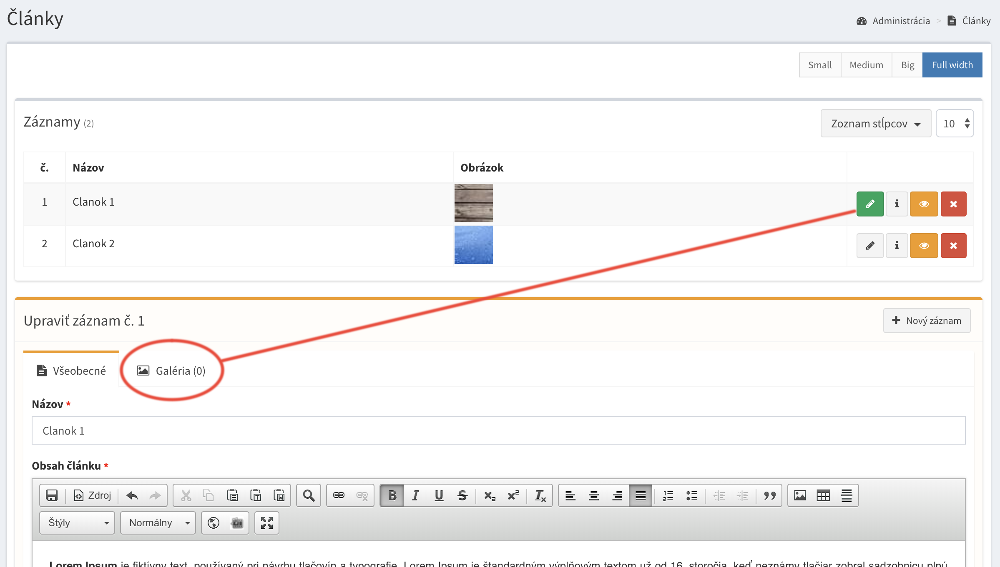
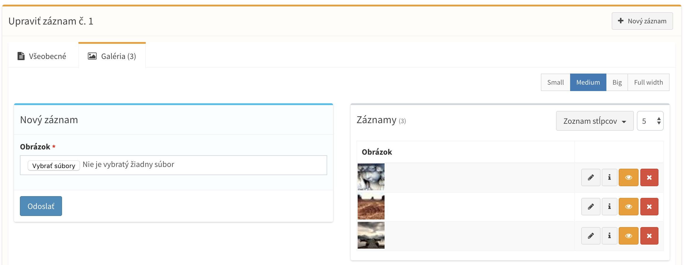
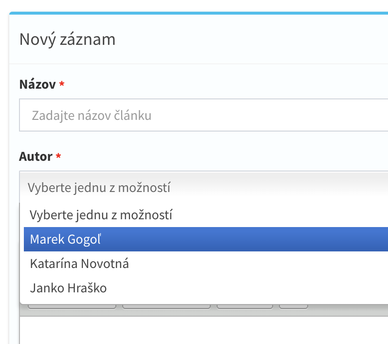
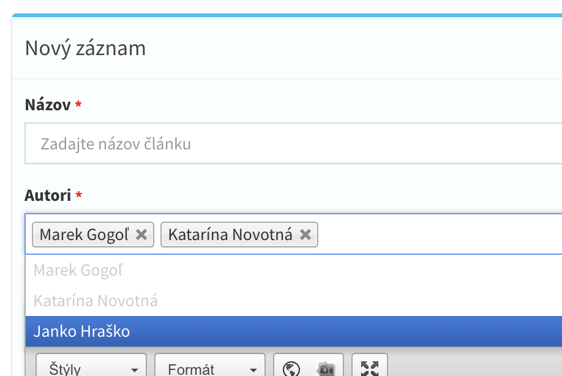
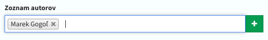

# Databázové relácie

Všetky systémy, od najzakladnejších CMS systémov, po robustné systémy spravujúce tisíce záznamov, sa neobidú bez relačných databáz poskytujúcich relácie medzi viacerými tabuľkami a ich záznamami.

Rozšírenie CrudAdmin plne automatizovalo všetky relácie medzi modelmi automatickým vygenerovaním rozhrania podporujúceho relácie, automatickým návrhom relačnej databázy, až po výpis a prepojenie tychto relácii v administrácii.

- [Stromové vetvenie modelov](#stromové-vetvenie-modelov)
- [Relácie vo vstupnóm poli](#Relácie-vo-vstupnóm-poli)
- [Nastavenia relácii vo vstupnóm poli](#Nastavenia-relácii-vo-vstupnóm-poli)
- [Výber relačných záznamov](#výber-relačných-záznamov)

<hr>

## Stromové vetvenie modelov

Medzi stromové vetvenie modelov patrí relácia **Many to one**, kde k jednému záznamu je možné priradiť ďalšie pod-zaznámy. V tomto prípade bude pri úprave záznamu v administrácii zobrazený ďalší vnorený formulár na správu záznamov, ktoré budú naviazané na existujúci rodičovský záznam.



Po otvorení záložky pod-modulu bude zobrazená vnorená správa ďalšieho modulu, ktorý je priradený k rodičovskému modulu, v tomto prípade článku.




Pre vetvenie obsahu existuje parameter `$belongsToModel`, ktorý definuje vzťah medzi dvoma alebo viacerými Admin Modelmi.

```php
class OrdersItem extends AdminModel
{
    ...

    protected $belongsToModel = Order::class;
}
```

Pri kombinacii, ak je model dieťaťom viacerých Admin Modelov zároveň, je možné parameter zapísať vo forme poľa. Napríklad model spravujúci galériu môže patriť k Novinkam, Článkom, Blogu, pričom každá táto obsahova funkcionalita je reprezentovaná samostatnou tabuľkou.

```php
protected $belongsToModel = [Article::class, News::class, Blog::class];
```

> Príklad tejto relácie sa da použiť ako v prípade potreby galérie ku článku, tak isto aj k priradeniu produktov k objednávke, a mnoho ďalšieho, kde je potrebné správu relácii vetviť do stromových podsekcii.

> Stromové vetvenie podporuje nekonečné množstvo levelov vetvenia a taktiež rekurzívne naviazanie toho istého modela na seba samého.

!> V databáze sa medzi tabuľkami automatický vytvoria cudzie kľúče.


!> Pri vytvárani stromovej štruktúry je nutné dodržať správnu konvenciu pomenovania Admin modelov. Vždy vytváraný model musí niesť anglický názov v singulári. Relačný model, ktorý bude vnorený do rodičovského modela musí začínať názvom nadradeného modela v pluráli a názov vytvoreného modela je zapísaný singulárom na konci názvu modela. Príklad model objednávky s názvom **Order** bude obsahovať podmodul produktov, ktorý sa bude menovať **OrdersItem**. Ak podmodul produktov bude obsahovať ďalší vnorený podmodul variant, názov modelu bude **OrdersItemsVariant**.

<hr>

## Relácie vo vstupnóm poli

V ďalších prípadoch relácii sa vyskytuje potreba prepojenia dvoch nezavislých komponentov/tabuliek medzi sebou, kde sa každý model v administrácii nachádza na oddelenom mieste, bez stromového prepojenia medzi sebou.

Tento druh relácii sa vykonáva pomocou vstupných polí, kde je záznam vo formulári pomocou vyrolovacieho poľa naviazaný na iný záznam v inej tabuľke. K prepojeniu služia parametre `belongsTo` a `belongsToMany`, ktoré sa postarajú o prepojenie záznamu s ďalším jedným, popripade viacerými záznamami naraz.

#### One to One / Many to One
V tomto prípade je k záznamu rodičovského modelu priradený ďalší záznam, čím vznika relacia Many to one, keďže viacero rodičovských záznamov môže byť priradených k jednemu záznamu z rozdielnej tabuľky.

```php
class Article extends AdminModel
{
    ...

    protected $fields = [
        'name' => 'name:Názov článku',
        'author' => 'name:Autor|belongsTo:authors,name'
    ];
```



#### Many to many

```php
class Article extends AdminModel
{
    ...

    protected $fields = [
        'name' => 'name:Názov článku',
        'authors' => 'name:Autor|belongsToMany:authors,name'
    ];
```



!> Pri relácii **Many to Many** systém CrudAdmin automatický vytvori pomocnú pivot tabuľku, v ktorej prepojí záznamy medzi sebou.

<hr>

## Nastavenia relácii vo vstupnóm poli

Relácie vo vstupných poliach poskytujú ďalšie nastavenia, vďaka ktorým je možné vytvoriť používateľské rozhranie ešte efektívnejšie, či rozsiahlejšie. Všetky tieto nastavenia sú vypísane v tejto sekcii nižšie.

#### Filtrácia záznamov vo vstupnóm poli

V prípade, ak potrebujete filtrovať záznamy v zozname položiek na výber, je možné použiť parameter `filterBy`, ktorý na základe hodnoty z iného vstupného poľa vyfiltruje položky v aktuálnom zozname.

`filterBy:field_name,database_column_name`

V tomto príklade znázornime filtráciu článkov, priradených pod autorom. Po vybere autora sa zobrazí druhé vstupné pole, už s vyfiltrovanými článkami daného autora.
```php
protected $fields = [
    'author' => 'name:Autor|belongsTo:authors,username'
    'article' => 'name:Článok autora|belongsTo:articles,name|filterBy:author'
];
```

!> Prvý parameter atribútu `filterBy` je kľúč vstupného poľa z formulára, podľa ktorého budeme filtrovať *(author)*. Druhý parameter, je stĺpec v databáze z tabuľky, v ktorej filtrujeme záznamy *(articles)*. Ak sa názov stĺpca v Admin Modely nezhoduje s názvom stĺpcu v databáze, v tom prípade je potrebne pridať aj druhý nepovinný parameter `filterBy:author,author_id`, ktorý je v tomto prípade povinný.

!> Ak je názov stĺpcu, podľa ktorého filtrujeme `author`, parameter `filterBy` inteligentné uhádne, že relačný stĺpec vo filtrovanej tabuľke sa bude volať `author_id`, preto nie je druhý parameter v tomto prípade potrebné vypĺniať.

!> Pre správne fungovanie parametru `filterBy`, je nutné mať nastavene správne cudzie kľúče medzi tabúľkami. V tomto príklade tabuľka `articles` musí obsahovať stĺpec `author_id`, vďaka ktorému administrácia automaticky vyfiltruje dané záznamy.

Filtrácia záznamov funguje aj podľa statické typov možnosti na výber.
```php
protected $fields = [
    'color' => 'name:Farba auta|type:select|options:black,white'
    'cars' => 'name:Model|belongsTo:cars,name|filterBy:color,color'
];
```

!> V tomto prípade pre správne fungovanie parametru `filterBy`, je nutné mať v tabuľke `cars` stĺpec s názvom `color`, podľa ktorého budeme filtrovať farbu auta.

#### Predvyplnianie hodnôt z relačného vstupného poľa

Parameter `fillBy` slúžy k predvypĺneniu statickej hodnoty vo formulári z vybraného relačného záznamu.

`fillBy:field_name,database_column_name`

V nasledujúcom príklade, predvypĺnime meno a vek autora, po vybraní záznamu vo vstupnóm poli `author`.
```php
protected $fields = [
    'author' => 'name:Autor|belongsTo:authors,username'
    'username' => 'name:Meno autora|type:string|fillBy:author.username'
    'age' => 'name:Vek autora|type:integer|fillBy:author.age'
];
```

#### Prepojenie vstupného poľa s rozhraním pre pridavanie nových záznamov

V oboch typoch **belongsTo** a **belongsToMany** vo vstupných poliach je možné povoliť pridávanie záznamov do danej relačnéj tabuľky priamo zo vstupného poľa. Túto funkcionalitu je možné povoliť pomocou parametru `canAdd`.

```php
protected $fields = [
    'authors' => 'name:Autor|belongsToMany:authors,name|canAdd'
];
```



!> Po kliku na ikonu pridania nového záznamu, sa otvori modálne okno s pridaním nového relačného záznamu.

<hr>

## Výber relačných záznamov

Framework Laravel k výberu relačných záznamov potrebuje v modely zadefinovať metódy, ktoré definujú [vzťahy medzi ďalšími modelmi](https://laravel.com/docs/master/eloquent-relationships#defining-relationships).

Systém CrudAdmin túto potrebú plné automatizoval tým, že mapuje modely medzi sebou na základe vstupných hodnôt, či stromového vetvenia modulov. Samozrejme v prípade potreby možnosť definovania vlastných relácii v modely ostala.

### Príklad výberu relácie umiestnenej v stromovej štruktúre
V tomto príklade je znazornená stromova štuktúra relácie, kde budeme pracovať s Objednávkou, ktorá obsahuje viacero objednaných položiek.

##### Modul objednávky, obsahujúci zoznam objednaných produktov.

```php
class Order extends AdminModel
{
    ...

    protected $fields = [
        'number' => 'name:Číslo objednávky|required',
    ];
```

##### Modul objednaného produktu, naviazaný na jednotlivú objednávku.

```php
class OrdersItem extends AdminModel
{
    ...

    protected $belongsToModel = Order::class;

    protected $fields = [
        'name' => 'name:Názov produktu|required',
    ];
```

##### Výber objednaných produktov z konkretnej objednávky

```php
$order = Order::find(1);

$items = $order->items()->get(); // New Query
$items2 = $order->items; //New Query
$items3 = $order->items; //Cached query
```

##### Výber konkretnej objednávky z objednaného produktu

```php
//Get random item
$item = OrdersItem::inRandomOrder()->first();

//Get order of purchased item
$order = $item->order;

//Get order of purchased item with custom rules
$order = $item->order()
              ->select(['number'])
              ->first();
```

### Príklad výberu relácie priradeného v úprave záznamu

##### Modul autorov
Zoznam autorov, kde každý autor bude priradený k článku.
```php
class Author extends AdminModel
{
    ...

    protected $fields = [
        'name' => 'name:Meno a priezvisko|required',
    ];
```

##### Modul štítkov
Zoznam štítkov, ktoré budu priradené k článku. Jeden článok môže obsahovať viacero štítkov.
```php
class Tag extends AdminModel
{
    ...

    protected $fields = [
        'tagname' => 'name:Názov štítku|required',
    ];
```

##### Modul článkov
Zoznam článkov, kde každý článok ma jedneho autora, a môže obsahovať viacero štítkov.
```php
class Article extends AdminModel
{
    ...

    protected $fields = [
        'name' => 'name:Názov článku|required',
        'author' => 'name:Autor|belongsTo:authors,name',
        'tags' => 'name:Zoznam štítkov|belongsTo:tags,tagname',
    ];
```

##### Výber autora, štítkov z konkretného článku

```php
$article = Article::find(1);

//Get author of article
$author = $article->author;

//Get all tags associated to this article
$tags = $article->tags;

//Get all articles associated to this author
$author->articles;
```

!> Pri správnom dodržaní názvov relácii definovaných vo vstupných hodnotách, či správnom dodržaní množného čísla v angličtine pri výbere záznamov, sú relácie plne automatický nabindovane medzi modelmi.