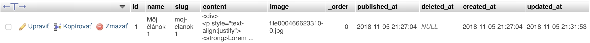
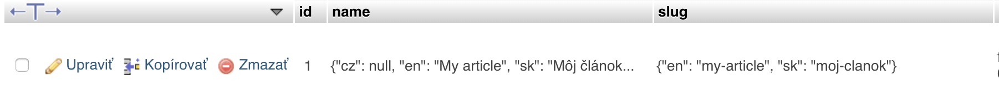

# Pekné url

Množstvo webov potrebuje svoje podstránky zobrazovať na základe vygenerovaných *nice friendly* url adries reprezentujúce záznamy v databáze, namiesto výberu záznamov podľa id.

- [Generovanie pekných url adries](#generovanie-pekných-url-adries)
- [Podpora viac jazyčných slugov](#podpora-viac-jazyčných-slugov)
- [Výber záznamu pomocou slugu](#výber-záznamu-pomocou-slugu)

!> **Vyberanie záznamu pomocou ID**
<br>
example.com/clanok/**1**

!> **Vyberanie záznamu pomocou slugu**
<br>
example.com/clanok/**moj-clanok**

## Generovanie pekných url adries
Pre tento prípad poskytuje rozšírenie CrudAdmin jednoduchú správu generovanie slugov na základe hodnôt z databázy pomocou vlastnosti `sluggable` v Admin Modeli.

```php
class Article
{
    ...

    /*
     * Sluggable
     */
    protected $sluggable = 'name';

    ...
    protected $fields = [
        'name' => 'name:Názov|placeholder:Zadajte názov článku|required|max:90',
        'content' => 'name:Obsah článku|type:editor|required',
        'image' => 'name:Obrázok|type:file|image|required',
    ];
}
```

Po zadefinovaní vlastnosti `sluggable`, ktorá reprezentuje stĺpec poľa, z ktorého sa budu **automaticky** generovať url adresy, sa v databáze vytvorí pomocný stĺpec s názvom `slug`, do ktorého bude po vytvorení, či úprave záznamu uložená vygenerovaná hodnota slugu z tohto stĺpca.



!> V prípade, že vygenerovaná hodnota slugu po vytvorení záznamu už v databáze existuje, bude za adresu slugu dosadená inkrementálna hodnota v poradí existéncie daného slugu. V preklade pokial 3 záznamy obsahuju názov **Môj članok**, slugy budú vygenerované s nasledujúcimi hodnotmi **moj-clanok**, **moj-clanok-1**, **moj-clanok-2**.

## Podpora viac jazyčných slugov
Pokiaľ vstupné pole obsahuje parameter `locale`, ktorý prekladá záznam do viacerých jazykov, bude hodnota v stĺpci `slug` uložená vo formáte typu **JSON**, kde každý jazyk bude obsahovať vlastnú hodnotu slugu.

```php
...

/*
 * Sluggable
 */
protected $sluggable = 'name';

protected $fields = [
    'name' => 'name:Názov|locale|required',
];
```



!> Pokial záznam nemá v administrácii priradený preklad, systém CrudAdmin automatický použije slug z hlavného jazyka, alebo dostupnej preloženej hodnoty.

?> Viac o preklade záznamov a textu nájdete v sekcii [jazykové mutácie](languages.md#Jazykové-mutácie).

## Výber záznamu pomocou slugu

##### Výber záznamu z databázy pomocou slugu
V kontroléri k výberu záznamu z databázy CrudAdmin sprístupnil metódu `findBySlug()` alebo `findBySlugOrFail()`, ktoré vyhľadajú záznam na základe hodnoty slugu z url adresy, ktorá bola dosadená ako parameter v url adrese.

```php
class ArticleController extends Controller
{
    ...

    public function show($slug)
    {
        $article = Article::findBySlugOrFail($slug);

        return view('article')->withArticle($article);
    }
```

##### Pristúpenie k hodnote slugu
Pokial chceme pristúpiť k hodnote slugu v danom zázname, jednoducho použíjeme metódu `$article->getSlug()`, ktorá vráti vygenerovanú hodnotu slugu z daného záznamu v databáze.

```php
<a href="{{ action('ArticleController@show', $article->getSlug()) }}">
    {{ $article->name }}
</a>
```
